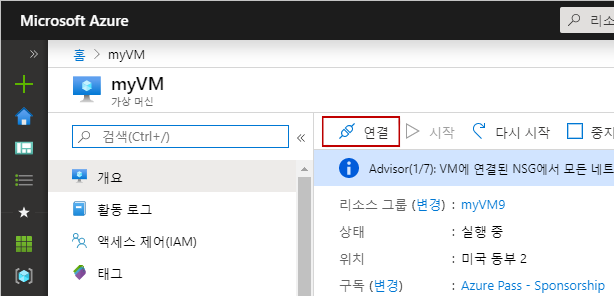
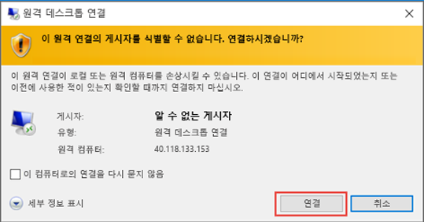
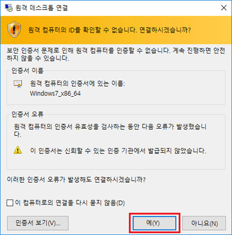
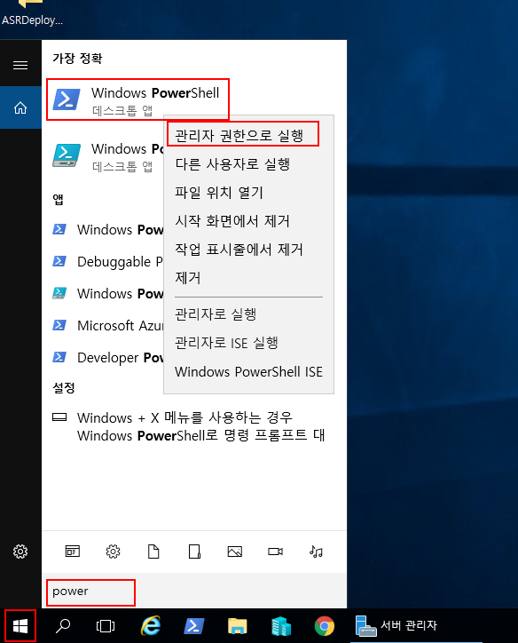
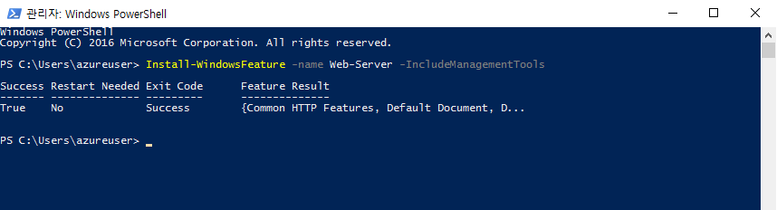
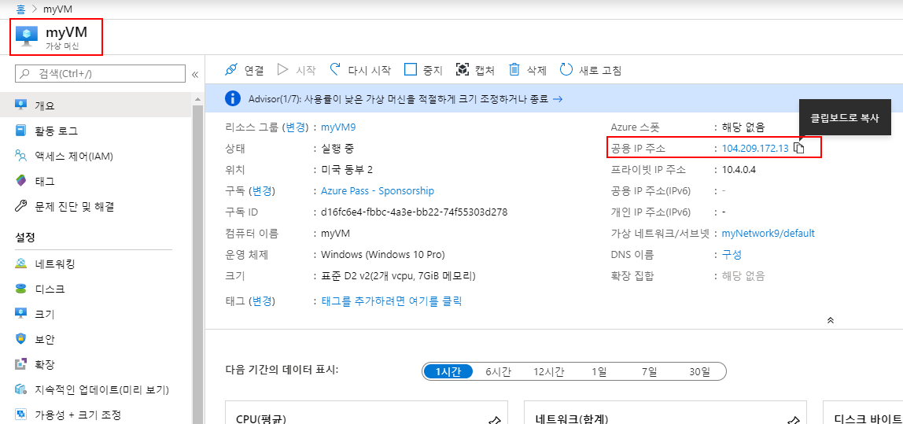
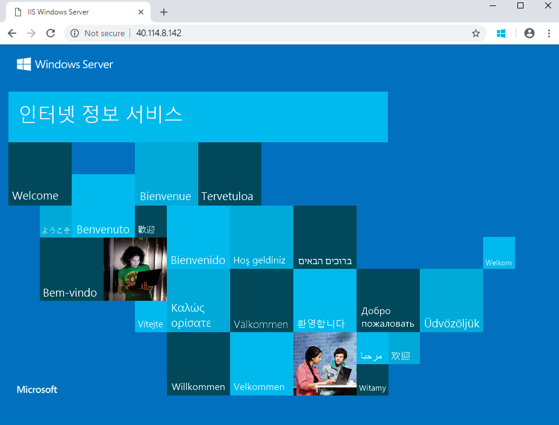

---
wts:
  title: 01 - 포털에서 가상 머신 만들기(10분)
  module: Module 02 - Core Azure Services (Workloads)
---
# <a name="01---create-a-virtual-machine-in-the-portal-10-min"></a>01 - 포털에서 가상 머신 만들기(10분)

이 연습에서는 Azure Portal에서 가상 머신을 만들고 이 가상 머신에 연결하여 웹 서버 역할을 설치하고 테스트합니다. 

**참고**: 이 연습을 수행하는 동안 정보 아이콘을 클릭하고 확인하세요. 

# <a name="task-1-create-the-virtual-machine"></a>작업 1: 가상 머신 만들기 
1. Azure Portal에 로그인: **https://portal.azure.com**

3. Portal 메뉴의 **모든 서비스** 블레이드에서 **가상 머신**을 검색하고 선택한 후에 **+만들기**를 클릭하고 드롭다운에서 **+Azure 가상 머신**을 선택합니다.

4. **기본** 탭에서 다음 정보를 채웁니다(다른 항목은 기본값을 사용).

    | 설정 | 값 |
    |  -- | -- |
    | 구독 | **제공된 기본값 사용** |
    | Resource group | **새 리소스 그룹 만들기** |
    | 가상 머신 이름 | **myVM** |
    | 지역 | **(미국) 미국 동부**|
    | 가용성 옵션 | 인프라 중복 옵션 필요 없음|
    | 이미지 | **Windows Server 2019 Datacenter - Gen2**|
    | 크기 | **표준 D2s v3**|
    | 관리자 계정 사용자 이름 | **azureuser** |
    | 관리자 계정 암호(정확하게 입력!) | **Pa$$w0rd1234**|
    | 인바운드 포트 규칙 - | **선택 포트 허용**|
    | 인바운드 포트 선택 | **RDP(3389)** 및 **HTTP(80)**| 

5. 네트워킹 탭으로 전환하여 **인바운드 포트 선택** 섹션에서 **HTTP(80) 및 RDP(3389)** 를 선택했는지 확인합니다.

6. 관리 탭으로 전환하고 **모니터링** 섹션에서 다음 설정을 선택합니다.

    | 설정 | 값 |
    | -- | -- |
    | 부트 진단 | 사용 안 함|

7. 나머지 값은 기본값을 그대로 유지한 다음 페이지 아래쪽에 있는 **검토 + 만들기** 단추를 클릭합니다.

8. Once Validation is passed click the <bpt id="p1">**</bpt>Create<ept id="p1">**</ept> button. It can take anywhere from five to seven minutes to deploy the virtual machine.

9. 배포 페이지와 **알림** 영역(상단 메뉴 모음의 종 아이콘)을 통해 업데이트가 제공됩니다.

# <a name="task-2-connect-to-the-virtual-machine"></a>작업 2: 가상 머신에 연결

이 작업에서는 RDP(원격 데스크톱 프로토콜)를 사용하여 새 가상 머신에 연결합니다. 

1. 상단 파란색 도구 모음에서 종 아이콘을 클릭하고, 배포가 성공하면 '리소스로 이동'을 선택합니다. 

    **참고**: 배포 페이지에서 **리소스로 이동** 링크를 사용할 수도 있습니다. 

2. 가상 머신의 **개요** 블레이드에서 **연결** 단추를 클릭하고 드롭다운에서 **RDP**를 선택합니다.

    

    <bpt id="p1">**</bpt>Note<ept id="p1">**</ept>: The following directions tell you how to connect to your VM from a Windows computer. On a Mac, you need an RDP client such as this Remote Desktop Client from the Mac App Store and on a Linux computer you can use an open source RDP client.

2. On the <bpt id="p1">**</bpt>Connect to virtual machine<ept id="p1">**</ept> page, keep the default options to connect with the public IP address over port 3389 and click <bpt id="p2">**</bpt>Download RDP File<ept id="p2">**</ept>. A file will download on the bottom left of your screen.

3. 다운로드된 RDP 파일(랩 머신의 왼쪽 하단에 위치함)을 **열고**, 관련 메시지가 표시되면 **연결**을 클릭합니다. 

    

4. **Windows 보안** 창에서, VM을 만들 때 사용한 관리자 자격 증명 **azureuser**와 암호 **Pa$$w0rd1234**를 사용하여 로그인합니다. 

5. You may receive a warning certificate during the sign-in process. Click <bpt id="p1">**</bpt>Yes<ept id="p1">**</ept> or to create the connection and connect to your deployed VM. You should connect successfully.

    

A new Virtual Machine (myVM) will launch inside your Lab. Close the Server Manager and dashboard windows that pop up (click "x" at top right). You should see the blue background of your virtual machine. <bpt id="p1">**</bpt>Congratulations!<ept id="p1">**</ept> You have deployed and connected to a Virtual Machine running Windows Server. 

# <a name="task-3-install-the-web-server-role-and-test"></a>작업 3: 웹 서버 역할 설치 및 테스트

이 작업에서는 방금 만든 가상 머신의 서버에 웹 서버 역할을 설치하고 기본 IIS 시작 페이지가 표시되는지 확인합니다. 

1. 새로 연 가상 머신의 검색 창에서 **PowerShell**을 검색하여 PowerShell을 시작하고, 검색되면 **Windows PowerShell**을 마우스 오른쪽 단추로 클릭하여 **관리자 권한으로 실행**합니다.

    

2. In PowerShell, install the <bpt id="p1">**</bpt>Web-Server<ept id="p1">**</ept> feature on the virtual machine by running the following command. (Paste in the command and hit ENTER for the installment to begin).

    ```PowerShell
    Install-WindowsFeature -name Web-Server -IncludeManagementTools
    ```
  
3. When completed, a prompt will state <bpt id="p1">**</bpt>Success<ept id="p1">**</ept> with a value <bpt id="p2">**</bpt>True<ept id="p2">**</ept>. You do not need to restart the virtual machine to complete the installation. Close the RDP connection to the VM by clicking the <bpt id="p1">**</bpt>x<ept id="p1">**</ept> on the blue bar at the top center of your virtual machine. You can also minimize it by clicking the <bpt id="p1">**</bpt><ph id="ph1">-</ph><ept id="p1">**</ept> on the blue bar at the top center.

    

4. 포털로 돌아가서 myVM의 **개요** 블레이드로 다시 이동하고, **클립보드에 복사** 단추를 사용하여 myVM의 공용 IP 주소를 복사하고, 새 브라우저 탭을 열고, 공용 IP 주소를 URL 텍스트 상자에 붙여 넣고, **Enter** 키를 눌러서 이동합니다.

    

5. 기본 IIS 웹 서버 시작 페이지가 표시됩니다.

    

<bpt id="p1">**</bpt>Congratulations!<ept id="p1">**</ept> You have created a new VM running a web server that is accessible via its public IP address. If you had a web application to host, you could deploy application files to the virtual machine and host them for public access on the deployed virtual machine.


<bpt id="p1">**</bpt>Note<ept id="p1">**</ept>: To avoid additional costs, you can optionally remove this resource group. Search for resource groups, click your resource group, and then click <bpt id="p1">**</bpt>Delete resource group<ept id="p1">**</ept>. Verify the name of the resource group and then click <bpt id="p1">**</bpt>Delete<ept id="p1">**</ept>. Monitor the <bpt id="p1">**</bpt>Notifications<ept id="p1">**</ept> to see verify that the deletion completed successfully. 
