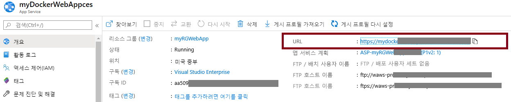
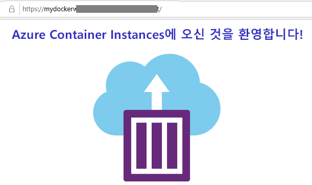

---
wts:
  title: 02 - 웹앱 만들기(10분)
  module: Module 02 - Core Azure Services (Workloads)
---
# 02 - 웹앱 만들기(10분)

In this walkthrough, we will create a web app that runs a Docker container. The Docker container contains a Welcome message. 

Azure App Service are actually a collection of four services, all of which are built to help you host and run web applications. The four services (Web Apps, Mobile Apps, API Apps, and Logic Apps) look different, but in the end they all operate in very similar ways. Web Apps are the most commonly used of the four services, and this is the service that we will be using in this lab.

# 작업 1: 웹앱 만들기 

이 작업에서는 Azure App Service 웹앱을 만듭니다. 

1. [Azure 포털](http://portal.azure.com/)에 로그인합니다. 

2. **모든 서비스** 블레이드에서 **App Services**를 검색하여 선택하고 **+ 추가, + 만들기, + 새로 만들기**를 클릭합니다.

3. On the <bpt id="p1">**</bpt>Basics<ept id="p1">**</ept> tab of the <bpt id="p2">**</bpt>Web App<ept id="p2">**</ept> blade, specify the following settings (replace <bpt id="p3">**</bpt>xxxx<ept id="p3">**</ept> in the name of the web app with letters and digits such that the name is globally unique). Leave the defaults for everything else, including the App Service Plan. 

    | 설정 | 값 |
    | -- | -- |
    | 구독 | **제공된 기본값 사용** |
    | 리소스 그룹 | **새 리소스 그룹 만들기**|
    | Name | **myDockerWebAppxxxx** |
    | 게시 | **Docker 컨테이너** |
    | 운영 체제 | **Linux** |
    | 지역 | **미국 동부** |
    
    **참고:** **xxxx**를 고유한 웹앱 이름으로 변경하는 것을 잊지 마세요.

4. **다음 > Docker**를 클릭하고 컨테이너 정보를 구성합니다.  

    | 설정 | 값 |
    | -- | -- |
    | 옵션 | **단일 컨테이너** |
    | 이미지 원본 | **Docker Hub** |
    | 액세스 형식 | **공용** |
    | 이미지 및 태그 | **mcr.microsoft.com/azuredocs/aci-helloworld** |
    
 **참고:** 시작 명령은 선택 사항이며 이 연습에서는 필요하지 않습니다.

5. **검토 + 만들기**를 클릭한 다음 **만들기**를 클릭합니다. 

# 작업 2: 웹앱 테스트

이 작업에서는 웹앱을 테스트합니다.

1. 웹앱이 배포될 때까지 기다립니다.

2. **알림**에서 **리소스로 이동**을 클릭합니다. 

3. 이 연습에서는 Docker 컨테이너를 실행하는 웹앱을 만듭니다.

    

4. In a new browser window, paste the URl and press enter. The Welcome to Azure Container Instances! welcome message will be displayed.

    

5. Azure App Service는 웹 애플리케이션의 호스팅 및 실행을 지원하도록 설계된 4가지 서비스의 모음입니다. 

4가지 서비스(Web Apps, Mobile Apps, API Apps 및 Logic Apps)는 모습은 다르지만 모두 매우 유사한 방식으로 작동합니다.

축하합니다. Azure App Service를 만들었습니다.
