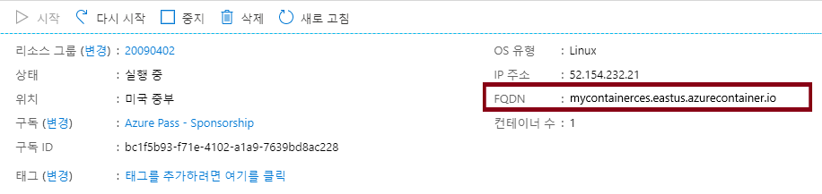
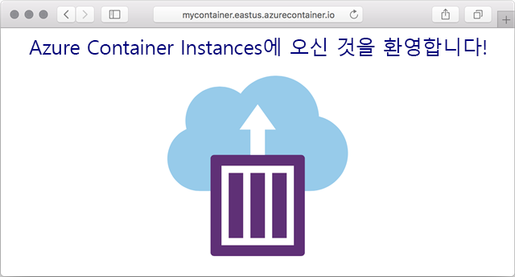

---
wts:
  title: 03 - Azure Container Instances 배포(10분)
  module: Module 02 - Core Azure Services (Workloads)
---

# 03 - Azure Container Instances 배포(10분)

In this walkthrough we create, configure, and deploy a container by using Azure Container Instances (ACI) in the Azure Portal. The container is a Welcome to ACI web application that displays a static HTML page. 

# 작업 1: 컨테이너 인스턴스 만들기 

이 작업에서는 웹 애플리케이션에 대한 새 컨테이너 인스턴스를 만듭니다.  

1. [Azure Portal](https://portal.azure.com)에 로그인합니다.

2. **모든 서비스** 블레이드에서 **컨테이너 인스턴스**를 검색하여 선택한 다음 **+ 추가, + 만들기, + 새로 만들기**를 클릭합니다. 

3. 새로운 컨테이너 인스턴스를 위해 다음과 같은 기본 정보를 제공합니다(그 외 항목은 기본값으로 유지). 

    | 설정| 값|
    |----|----|
    | 구독 | ***제공된 기본값 사용*** |
    | Resource group | **새 리소스 그룹 만들기** |
    | 컨테이너 이름| **mycontainer**|
    | 지역 | **(미국) 미국 동부** |
    | 이미지 원본| **Docker Hub 또는 기타 레지스트리**|
    | 이미지 형식| **공용**|
    | 이미지| **mcr.microsoft.com/azuredocs/aci-helloworld**|
    | OS 유형| **Linux** |
    | 크기| 기본값 유지******|

4. Configure the Networking tab (replace <bpt id="p1">**</bpt>xxxxx<ept id="p1">**</ept> with letters and digits such that the name is globally unique). Leave all other settings at their default values.

    | 설정| 값|
    |--|--|
    | DNS 이름 레이블| **mycontainerdnsxxxxx** |

    
    <bpt id="p1">**</bpt>Note<ept id="p1">**</ept>: Your container will be publicly reachable at dns-name-label.region.azurecontainer.io. If you receive a <bpt id="p1">**</bpt>DNS name label not available<ept id="p1">**</ept> error message following the deployment, specify a different DNS name label (replacing the xxxxx) and re-deploy. 

5. **검토 후 만들기**를 클릭하여 자동 유효성 검사 프로세스를 시작합니다.

6. **만들기**를 클릭하여 컨테이너 인스턴스를 만듭니다. 

7. 배포 페이지 및 **알림** 페이지를 모니터링합니다. 

# 작업 2: 컨테이너 인스턴스 배포 확인

이 작업에서는 시작 페이지가 표시되는지를 확인함으로써 컨테이너 인스턴스가 실행 중인지 확인합니다.

1. 배포가 완료된 후에 배포 블레이드에 있는 **리소스로 이동** 링크 또는 알림 영역의 리소스 링크를 클릭합니다.

2. **mycontainer**의 **개요** 페이지에서 컨테이너 **상태**가 **실행 중**인지 확인합니다. 

3. FQDN(정규화된 도메인 이름)을 찾습니다.

    

2. 이 연습에서는 Azure Portal에서 ACI(Azure Container Instances)를 사용하여 컨테이너를 생성, 구성 및 배포합니다. 

    

이 컨테이너는 정적 HTML 페이지를 표시하는 ACI 시작 웹 애플리케이션입니다.

<bpt id="p1">**</bpt>Note<ept id="p1">**</ept>: To avoid additional costs, you can optionally remove this resource group. Search for resource groups, click your resource group, and then click <bpt id="p1">**</bpt>Delete resource group<ept id="p1">**</ept>. Verify the name of the resource group and then click <bpt id="p1">**</bpt>Delete<ept id="p1">**</ept>. Monitor the <bpt id="p1">**</bpt>Notifications<ept id="p1">**</ept> to see how the delete is proceeding.
