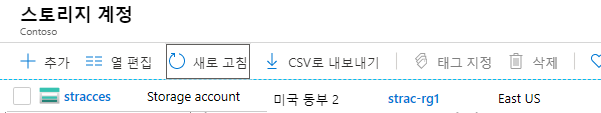
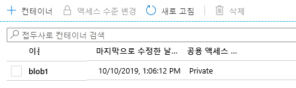

---
wts:
  title: 05 - Blob Storage 만들기(5분)
  module: Module 02 - Core Azure Services (Workloads)
---
# 05 - Blob Storage 만들기(5분)

이 연습에서는 스토리지 계정을 만든 다음 Blob Storage 파일로 작업합니다.

# 작업 1: 스토리지 계정 만들기 

이 작업에서는 새 스토리지 계정을 만듭니다. 

1. <a href="https://portal.azure.com" target="_blank">https://portal.azure.com</a>에서 Azure Portal에 로그인합니다.

2. **모든 서비스** 블레이드에서 **스토리지 계정**을 검색하여 선택한 다음 **+ 추가, + 만들기, + 새로 만들기**를 클릭합니다. 

3. On the <bpt id="p1">**</bpt>Basics<ept id="p1">**</ept> tab of the <bpt id="p2">**</bpt>Create storage account<ept id="p2">**</ept> blade, fill in the following information (replace <bpt id="p3">**</bpt>xxxx<ept id="p3">**</ept> in the name of the storage account with letters and digits such that the name is globally unique). Leave the defaults for everything else.

    | 설정 | 값 | 
    | --- | --- |
    | 구독 | **제공된 기본값 유지** |
    | Resource group | **새 리소스 그룹 만들기** |
    | 스토리지 계정 이름 | **storageaccountxxxxx** |
    | 위치 | **(미국) 미국 동부**  |
    | 성능 | **Standard** |
    | 중복 | **LRS(로컬 중복 스토리지)** |
    
    **참고** - **xxxxx**를 고유한 **스토리지 계정 이름**으로 변경하는 것을 잊지 마세요.

5. **검토 + 만들기**를 클릭하여 스토리지 계정 설정을 검토하고 Azure에서 구성의 유효성을 검사할 수 있도록 허용합니다. 

6. Once validated, click <bpt id="p1">**</bpt>Create<ept id="p1">**</ept>. Wait for the notification that the account was successfully created. 

7. 홈페이지에서 **스토리지 계정**을 검색하여 선택하고 새 스토리지 계정이 나열되어 있는지 확인합니다.

    

# 작업 2: Blob Storage으로 작업

이 작업에서는 Blob 컨테이너를 만들고 Blob 파일을 업로드합니다. 

1. 새 스토리지 계정의 이름을 클릭하고, **데이터 스토리지** 섹션으로 스크롤한 다음 **컨테이너**를 클릭합니다.

2. Click <bpt id="p1">**</bpt>+ Container<ept id="p1">**</ept> and complete the information. Use the Information icons to learn more. When done click <bpt id="p1">**</bpt>Create<ept id="p1">**</ept>.

    | 설정 | 값 |
    | --- | --- |
    | 이름 | **container1**  |
    | 공용 액세스 수준| **프라이빗(익명 액세스 없음)** |
  

    

4. Open a new browser window and search <bpt id="p1">**</bpt>Bing<ept id="p1">**</ept> for an image of a flower. Right click on the image and save it to your VM. 

6. Portal로 돌아가서 **container1**을 클릭한 다음 **업로드**를 선택합니다.

5. Browse for the image file you just saved on your local computer. Select it and then select upload.

   
6. **고급** 화살표를 클릭하고, 기본값을 그대로 두고 사용 가능한 옵션을 검토한 다음 **업로드**를 클릭합니다.

    <bpt id="p1">**</bpt>Note<ept id="p1">**</ept>: You can upload as many blobs as you like in this way. New blobs will be listed within the container.

7. 파일이 업로드되면 파일을 마우스 오른쪽 단추로 클릭하고 보기/편집, 다운로드, 속성 및 삭제와 같은 옵션을 확인할 수 있습니다. 

8. 시간이 있으면 파일, 테이블 및 큐에 대한 옵션을 검토합니다.

# 작업 3: 스토리지 계정 모니터링

1. 스토리지 계정 블레이드로 돌아가서 **문제 진단 및 해결**을 클릭합니다. 

2. Explore some of the most common storage problems. Notice there are multiple troubleshooters here.

3. On the storage account blade, scroll down to the <bpt id="p1">**</bpt>Monitoring<ept id="p1">**</ept> section and click <bpt id="p2">**</bpt>Insights<ept id="p2">**</ept>. Notice there is information on Failures, Performance, Availability, and Capacity. Your information will be different.

    

**스토리지 계정 만들기** 블레이드의 **기본** 탭에서 다음 정보를 채웁니다(스토리지 계정 이름의 **xxxx**를 이름이 전역적으로 고유하도록 문자와 숫자로 대체).

다른 항목은 기본값을 사용합니다.
