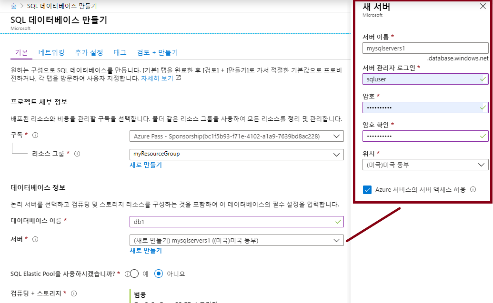
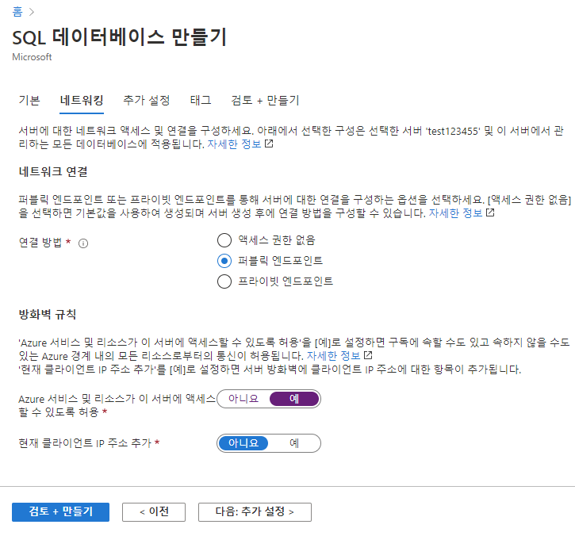
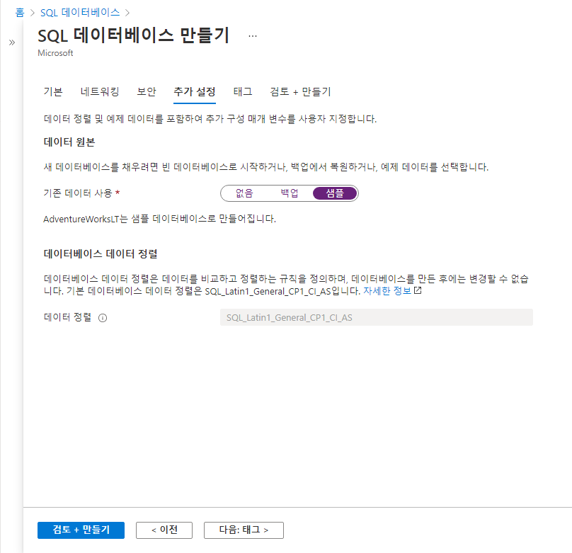
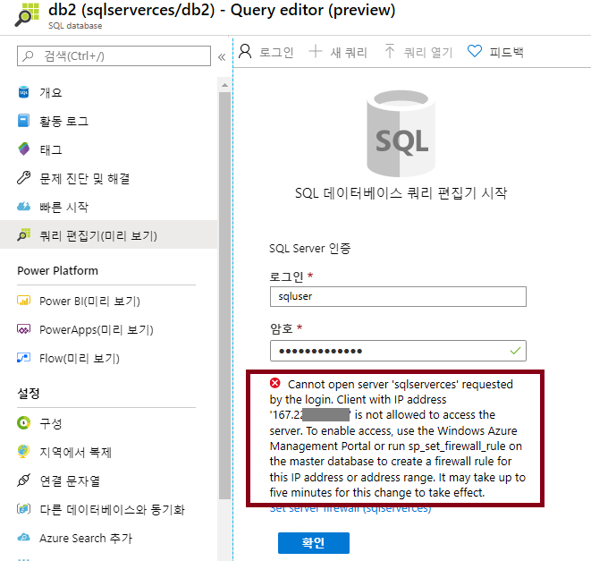
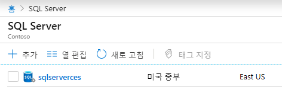
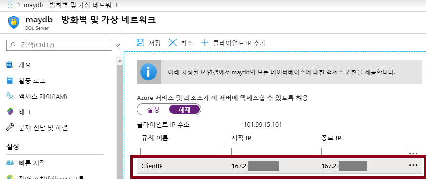
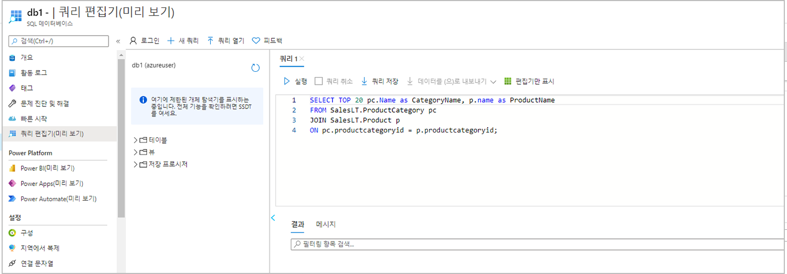
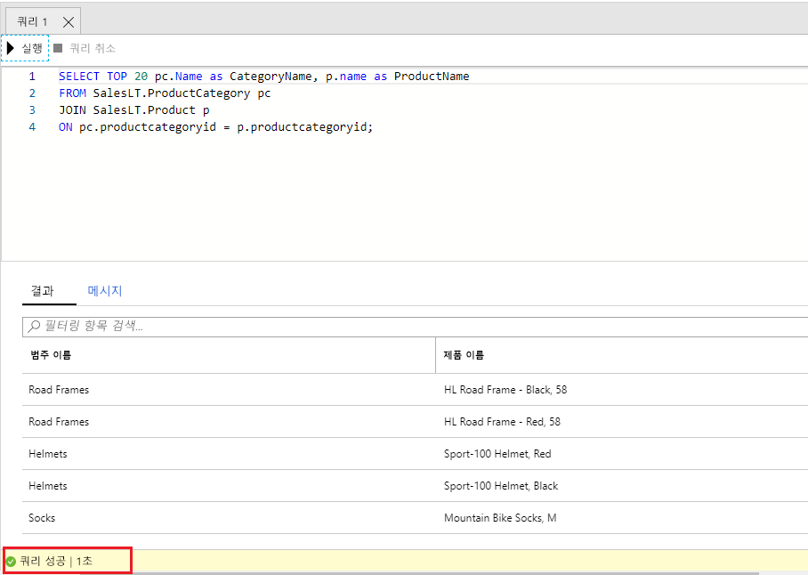

---
wts:
  title: 06 -SQL Database 만들기(5분)
  module: Module 02 - Core Azure Services (Workloads)
---

# <a name="06---create-a-sql-database-5-min"></a>06 -SQL Database 만들기(5분)

이 연습에서는 Azure에서 SQL Database를 만든 다음 해당 데이터베이스의 데이터를 쿼리합니다.

# <a name="task-1-create-the-database"></a>작업 1: 데이터베이스 만들기 

이 작업에서는 AdventureWorksLT 샘플 데이터베이스를 기반으로 SQL 데이터베이스를 만듭니다. 

1. [ **https://portal.azure.com** ](https://portal.azure.com)에서 Azure Portal에 로그인합니다.

2. **모든 서비스** 블레이드에서 **SQL Database**를 검색하여 선택한 다음 **+ 추가, + 만들기, + 새로 만들기**를 클릭합니다. 

3. **기본** 탭에서 다음 정보를 입력합니다.  

    | 설정 | 값 | 
    | --- | --- |
    | 구독 | **제공된 기본값 사용** |
    | Resource group | **새 리소스 그룹 만들기** |
    | 데이터베이스 이름| **db1** | 
    | 서버 | **새로 만들기** 선택(오른쪽에 새로운 사이드바가 열림)|
    | 서버 이름 | **sqlserverxxxx**(고유해야 함) | 
    | 위치 | **(미국) 미국 동부** |
    | 인증 방법 | **SQL 인증 사용** |
    | 서버 관리자 로그인 | **sqluser** |
    | 암호 | **Pa$$w0rd1234** |
    | 클릭  | **확인** |

   

4. **네트워킹** 탭에서 다음 설정을 구성합니다(다른 설정은 기본값으로 유지). 

    | 설정 | 값 | 
    | --- | --- |
    | 연결 방법 | **공용 엔드포인트** |    
    | Azure 서비스 및 리소스에서 이 서버에 액세스할 수 있도록 허용 | **예** |
    | 현재 클라이언트 IP 주소를 추가합니다. | **아니요** |
    
   

5. **보안** 탭에서 다음과 같이 구성합니다. 

    | 설정 | 값 | 
    | --- | --- |
    | Microsoft Defender for SQL| **지금은 아님** |
    
6. **추가 설정** 탭으로 이동합니다. AdventureWorksLT 샘플 데이터베이스를 사용합니다.

    | 설정 | 값 | 
    | --- | --- |
    | 기존 데이터 사용 | **샘플** |

    

7. Click <bpt id="p1">**</bpt>Review + create<ept id="p1">**</ept> and then click <bpt id="p2">**</bpt>Create<ept id="p2">**</ept> to deploy and provision the resource group, server, and database. It can take approx. 2 to 5 minutes to deploy.


# <a name="task-2-test-the-database"></a>작업 2: 데이터베이스를 테스트합니다.

이 작업에서는 SQL Server를 구성하고 SQL 쿼리를 실행합니다. 

1. When the deployment has completed, click Go to resource from the deployment blade. Alternatively, from the <bpt id="p1">**</bpt>All Resources<ept id="p1">**</ept> blade, search and select <bpt id="p2">**</bpt>Databases<ept id="p2">**</ept>, then <bpt id="p3">**</bpt>SQL databases<ept id="p3">**</ept> ensure your new database was created. You may need to <bpt id="p1">**</bpt>Refresh<ept id="p1">**</ept> the page.

    

2. Click the <bpt id="p1">**</bpt>db1<ept id="p1">**</ept> entry representing the SQL database you created. On the db1 blade click <bpt id="p1">**</bpt>Query editor (preview)<ept id="p1">**</ept>.

3. 암호 **Pa$$w0rd1234**를 사용하여 **sqluser**로 로그인합니다.

4. You will not be able to login. Read the error closely and make note of the IP address that needs to be allowed through the firewall. 

    

5. **db1** 블레이드로 돌아가서 **개요**를 클릭합니다. 

    

6. db1 **개요** 블레이드에서 개요 화면의 중앙 상단에 위치한 **서버 방화벽 설정**을 클릭합니다.

7. Click <bpt id="p1">**</bpt>+ Add client IP<ept id="p1">**</ept> (top menu bar) to add the IP address referenced in the error. (it may have autofilled for you - if not paste it into the IP address fields). Be sure to <bpt id="p1">**</bpt>Save<ept id="p1">**</ept> your changes. 

    

8. Return to your SQL database (slide the bottom toggle bar to the left) and click on <bpt id="p1">**</bpt>Query Editor (Preview)<ept id="p1">**</ept>. Try to login again as <bpt id="p1">**</bpt>sqluser<ept id="p1">**</ept> with the password <bpt id="p2">**</bpt>Pa$$w0rd1234<ept id="p2">**</ept>. This time you should succeed. Note that it may take a couple of minutes for the new firewall rule to be deployed. 

9. Once you log in successfully, the query pane appears. Enter the following query into the editor pane. 

    ```SQL
    SELECT TOP 20 pc.Name as CategoryName, p.name as ProductName
    FROM SalesLT.ProductCategory pc
    JOIN SalesLT.Product p
    ON pc.productcategoryid = p.productcategoryid;
    ```

    

10. Click <bpt id="p1">**</bpt>Run<ept id="p1">**</ept>, and then review the query results in the <bpt id="p2">**</bpt>Results<ept id="p2">**</ept> pane. The query should run successfully.

    

Congratulations! You have created a SQL database in Azure and successfully queried the data in that database.

<bpt id="p1">**</bpt>Note<ept id="p1">**</ept>: To avoid additional costs, you can optionally remove this resource group. Search for resource groups, click your resource group, and then click <bpt id="p1">**</bpt>Delete resource group<ept id="p1">**</ept>. Verify the name of the resource group and then click <bpt id="p1">**</bpt>Delete<ept id="p1">**</ept>. Monitor the <bpt id="p1">**</bpt>Notifications<ept id="p1">**</ept> to see how the delete is proceeding.
