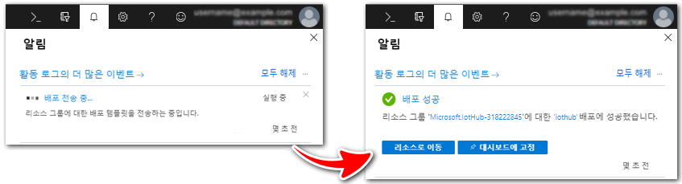
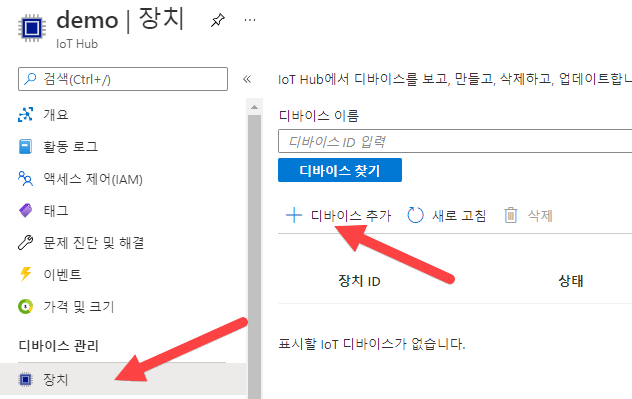
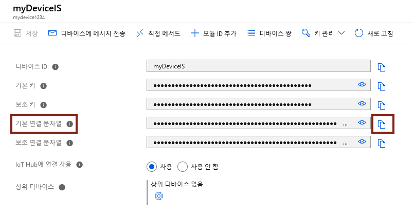
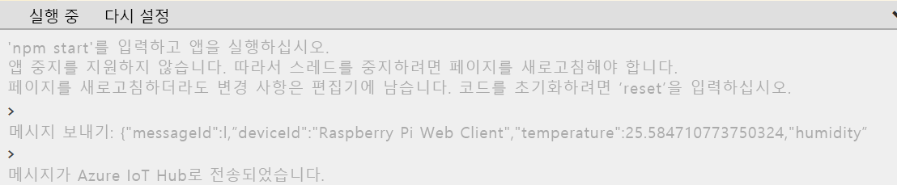
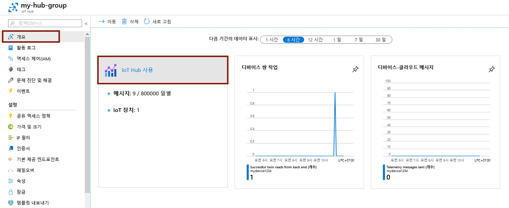

---
wts:
  title: 07 - Azure IoT Hub 구현(10분)
  module: 'Module 03: Describe core solutions and management tools'
---
# 07 - Azure IoT Hub 구현(10분)

In this walkthrough, we will configure a new Azure IoT Hub in Azure Portal, and then authenticate a connection to an IoT device using the online Raspberry Pi device simulator. Sensor data and messages are passed from the Raspberry Pi simulator to your Azure IoT Hub, and you view metrics for the messaging activity in Azure Portal.

# 작업 1: IoT 허브 만들기 

이 작업에서는 IoT 허브를 만듭니다. 

1. [Azure Portal](https://portal.azure.com)에 로그인합니다.

2. **모든 서비스** 블레이드에서 **IoT Hub**를 검색하여 선택한 다음 **+ 추가, + 만들기, + 새로 만들기**를 클릭합니다.

3. **IoT 허브** 블레이드의 **기본** 탭에서 다음 정보로 필드를 채웁니다(스토리지 계정 이름의 **xxxx**를 이름이 전역적으로 고유하도록 문자와 숫자로 대체).

    | 설정 | 값 |
    |--|--|
    | 구독 | **제공된 기본값 유지** |
    | 리소스 그룹 | **새 리소스 그룹 만들기** |
    | IoT Hub 이름 | **my-hub-groupxxxxx** |
    | 지역 | **미국 동부** |

    **참고** - **xxxxx**를 고유한 **IoT Hub 이름**으로 변경하는 것을 잊지 마세요.

4. **관리** 탭으로 이동하고 드롭다운을 사용하여 **가격 및 스케일 계층**을 **S1: 표준 계층**으로 설정하세요.

5. **검토 + 만들기** 단추를 클릭합니다.

6. **만들기** 단추를 사용하여 새 Azure IoT Hub 인스턴스를 만들기 시작합니다.

7. Azure IoT Hub 인스턴스가 배포될 때까지 기다립니다. 

# 작업 2: IoT 디바이스 추가

이 작업에서는 IoT Hub에 IoT 디바이스를 추가합니다. 

1. When the deployment has completed, click <bpt id="p1">**</bpt>Go to resource<ept id="p1">**</ept> from the deployment blade. Alternatively, from the <bpt id="p1">**</bpt>All services<ept id="p1">**</ept> blade, search for and select <bpt id="p2">**</bpt>IoT Hub<ept id="p2">**</ept> and locate your new IoT Hub instance

    

2. To add a new IoT device, scroll down to the <bpt id="p1">**</bpt>Device management<ept id="p1">**</ept> section and click <bpt id="p2">**</bpt>Devices<ept id="p2">**</ept>. Then, click <bpt id="p1">**</bpt>+ Add Device<ept id="p1">**</ept>.

    

3. 센서 데이터 및 메시지는 Raspberry Pi 시뮬레이터에서 Azure IoT Hub로 전달되며 Azure Portal에서 메시징 활동에 대한 메트릭을 볼 수 있습니다.

4. 새 디바이스가 표시되지 않으면 IoT 디바이스 페이지를 **새로 고칩니다**. 

5. Select <bpt id="p1">**</bpt>myRaspberryPi<ept id="p1">**</ept> and copy the <bpt id="p2">**</bpt>Primary Connection String<ept id="p2">**</ept> value. You will use this key in the next task to authenticate a connection to the Raspberry Pi simulator.

    

# 작업 3: Raspberry Pi 시뮬레이터를 사용하여 디바이스 테스트

이 작업에서는 Raspberry Pi 시뮬레이터를 사용하여 디바이스를 테스트합니다. 

1. Open a new tab in the web browser and type this shortcut link <ph id="ph1">https://aka.ms/RaspPi</ph>. It will take you to a Raspberry Pi Simulator site. If you have time, read about the Raspberry Pi simulator. When done select "<bpt id="p1">**</bpt>X<ept id="p1">**</ept>" to close the pop-up window.

2. In the code area on the right side, locate the line with 'const connectionString ='. Replace it with the connection string you copied from the Azure portal. Note that the connection sting includes the DeviceId (<bpt id="p1">**</bpt>myRaspberryPi<ept id="p1">**</ept>) and SharedAccessKey entries.

    

3. Click <bpt id="p1">**</bpt>Run<ept id="p1">**</ept> (below the code area) to run the application. The console output should show the sensor data and messages that are sent from the Raspberry Pi simulator to your Azure IoT Hub. Data and messages are sent each time the Raspberry Pi simulator LED flashes. 

    

5. **중지**를 클릭하여 데이터 전송을 중지합니다.

6. Azure Portal로 돌아갑니다.

7. Switch the IoT Hub <bpt id="p1">**</bpt>Overview<ept id="p1">**</ept> blade and scroll down to the <bpt id="p2">**</bpt>IoT Hub Usage<ept id="p2">**</ept> information to view usage. Change your timeframe in the <bpt id="p1">**</bpt>show data for last<ept id="p1">**</ept> to see data in the last hour.

    

Congratulations! You have set up Azure IoT Hub to collect sensor data from an IoT device.

<bpt id="p1">**</bpt>Note<ept id="p1">**</ept>: To avoid additional costs, you can optionally remove this resource group. Search for resource groups, click your resource group, and then click <bpt id="p1">**</bpt>Delete resource group<ept id="p1">**</ept>. Verify the name of the resource group and then click <bpt id="p1">**</bpt>Delete<ept id="p1">**</ept>. Monitor the <bpt id="p1">**</bpt>Notifications<ept id="p1">**</ept> to see how the delete is proceeding.
