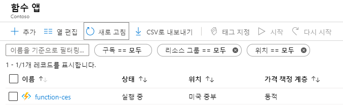
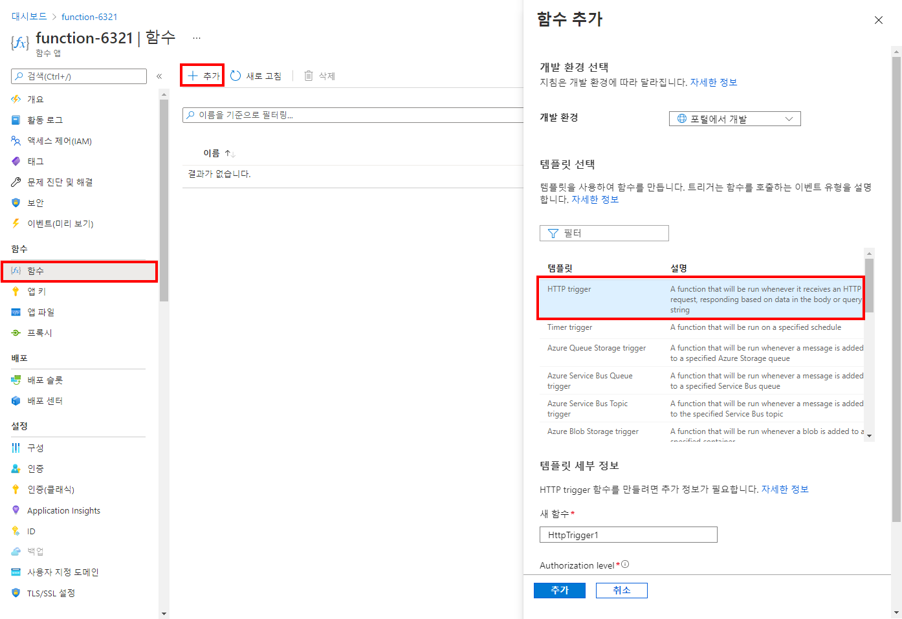
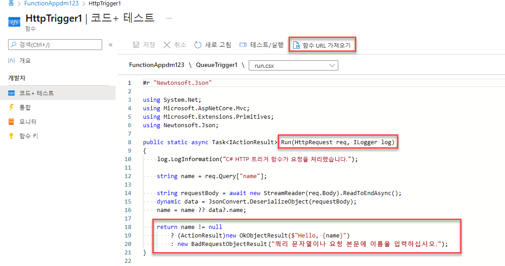
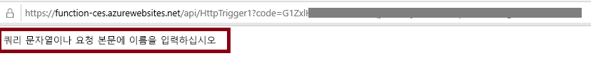
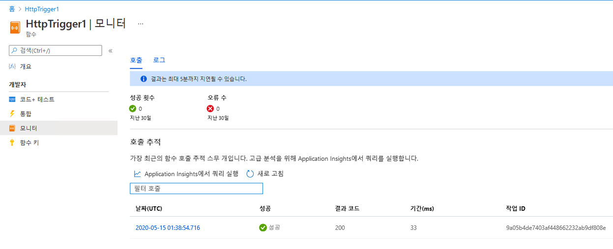

---
wts:
  title: 08 - Azure Functions 구현(5분)
  module: 'Module 03: Describe core solutions and management tools'
---
# 08 - Azure Functions 구현(5분)

이 연습에서는 HTTP 요청이 수신될 때 Hello 메시지를 표시하는 함수 앱을 만듭니다. 

# 작업 1: 함수 앱 만들기 

이 작업에서는 함수 앱을 만듭니다.

1. [Azure Portal](https://portal.azure.com)에 로그인합니다.

2. 포털 위쪽의 **검색** 상자에서 **함수 앱**을 검색하여 선택한 다음 **함수 앱** 블레이드에서 **+ 추가, + 만들기, + 새로 만들기**를 클릭합니다.

3. **함수 앱** 블레이드의 **기본** 탭에서 다음 설정을 지정합니다(함수 이름의 **xxxx**를 이름이 전역적으로 고유하도록 문자와 숫자로 대체하고 다른 모든 설정은 기본값으로 유지). 

    | 설정 | 값 |
    | -- | --|
    | 구독 | **제공된 기본값 유지** |
    | Resource group | **새 리소스 그룹 만들기** |
    | 함수 앱 이름 | **function-xxxx** |
    | 게시 | **코드** |
    | 런타임 스택 | **.NET** |
    | 버전 | **3.1** |
    | 지역 | **미국 동부** |

    **참고** - **xxxx**를 고유한 **함수 앱 이름**으로 변경하는 것을 잊지 마세요.

4. **검토 + 만들기**를 클릭하고, 유효성 검사가 성공적으로 완료된 후에 **만들기**를 클릭하여 새 Azure 함수 앱의 프로비전과 배포를 시작합니다.

5. 리소스가 생성되었다는 알림이 표시될 때까지 기다립니다.

6. When the deployment has completed, click Go to resource from the deployment blade. Alternatively, navigate back to the <bpt id="p1">**</bpt>Function App<ept id="p1">**</ept> blade, click <bpt id="p2">**</bpt>Refresh<ept id="p2">**</ept> and verify that the newly created function app has the <bpt id="p3">**</bpt>Running<ept id="p3">**</ept> status. 

    

# 작업 2: HTTP 트리거 함수 만들기 및 테스트

이 작업에서는 HTTP 요청이 수신될 때 웹후크 및 API 함수를 사용하여 메시지를 표시합니다. 

1. **함수 앱** 블레이드에서 새로 생성된 함수 앱을 클릭합니다. 

2. 함수 앱 블레이드의 **함수** 섹션에서 **함수**를 클릭한 다음 **+ 추가, + 만들기, + 새로 만들기**를 클릭합니다.

    

3. An <bpt id="p1">**</bpt>Add function<ept id="p1">**</ept> pop-up window will appear on the right. In the <bpt id="p1">**</bpt>Select a template<ept id="p1">**</ept> section click <bpt id="p2">**</bpt>HTTP trigger<ept id="p2">**</ept>. Click <bpt id="p1">**</bpt>Add<ept id="p1">**</ept> 

    

4. **HttpTrigger1** 블레이드의 **개발자** 섹션에서 **코드 + 테스트**를 클릭합니다. 

5. On the <bpt id="p1">**</bpt>Code + Test<ept id="p1">**</ept> blade, review the auto-generated code and note that the code is designed to run an HTTP request and log information. Also, notice the function returns a Hello message with a name. 

    

6. 함수 편집기의 최상위 섹션에서 **함수 URL 가져오기**를 클릭합니다. 

7. **키** 드롭다운 목록에 있는 값이 **기본값**으로 설정되었는지 확인하고 **복사**를 클릭하여 함수 URL을 복사합니다. 

    

8. Open a new browser tab and paste the copied function URL into your web browser's address bar. When the page is requested the function will run. Notice the returned message stating that the function requires a name in the request body.

    

9. URL의 끝에 **&name=*yourname***을 추가합니다.

    **참고**: 예를 들어 이름이 Cindy인 경우, 최종 URL은 다음과 비슷하게 됩니다. `https://azfuncxxx.azurewebsites.net/api/HttpTrigger1?code=X9xx9999xXXXXX9x9xxxXX==&name=cindy`

    

10. When you hit enter, your function runs and every invocation is traced. To view the traces, return to the Portal <bpt id="p1">**</bpt>HttpTrigger1 <ph id="ph1">\|</ph> Code + Test<ept id="p1">**</ept> blade and click <bpt id="p2">**</bpt>Monitor<ept id="p2">**</ept>. You can <bpt id="p1">**</bpt>configure<ept id="p1">**</ept> Application Insights by selecting the timestamp and click <bpt id="p2">**</bpt>Run query in Application Insights<ept id="p2">**</ept>.

     

Congratulations! You have created a Function App to display a Hello message when there is an HTTP request.  

<bpt id="p1">**</bpt>Note<ept id="p1">**</ept>: To avoid additional costs, you can optionally remove this resource group. Search for resource groups, click your resource group, and then click <bpt id="p1">**</bpt>Delete resource group<ept id="p1">**</ept>. Verify the name of the resource group and then click <bpt id="p1">**</bpt>Delete<ept id="p1">**</ept>. Monitor the <bpt id="p1">**</bpt>Notifications<ept id="p1">**</ept> to see how the delete is proceeding.
