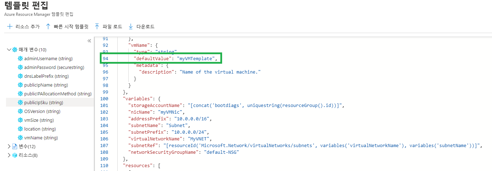
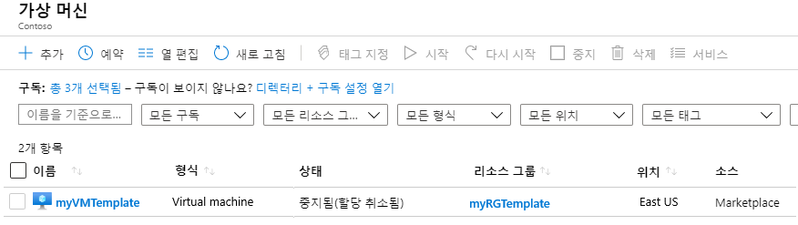
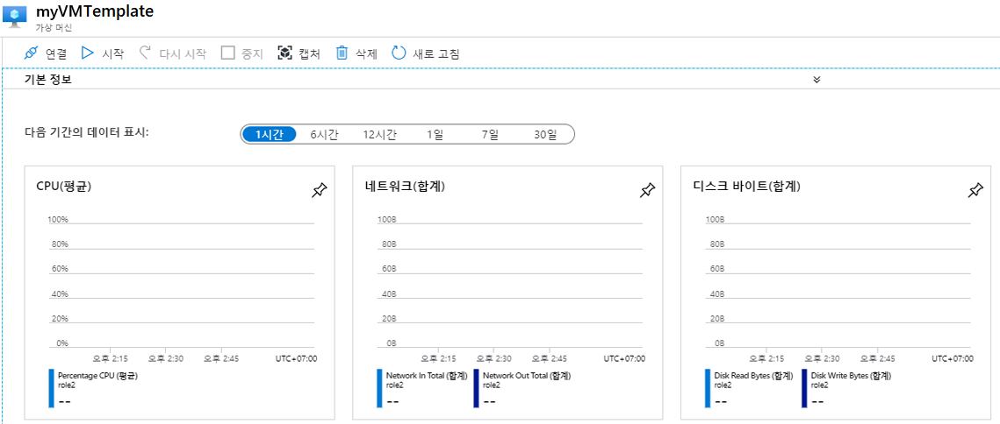
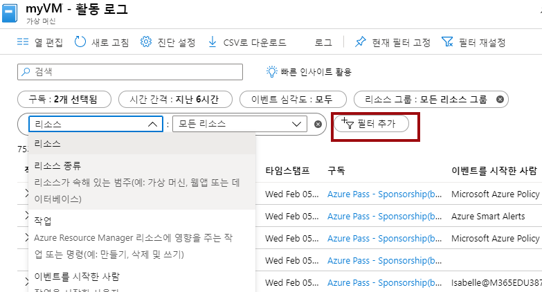

---
wts:
  title: 09 - 템플릿으로 VM 만들기(10분)
  module: 'Module 03: Describe core solutions and management tools'
---
# 09 - 템플릿으로 VM 만들기(10분)

이 연습에서는 QuickStart 템플릿을 사용하여 가상 머신을 배포하고 모니터링 기능을 검사합니다.

# 작업 1: 빠른 시작 갤러리 탐색 및 템플릿 찾기 

이 작업에서는 Azure QuickStart 갤러리를 찾아보고 가상 머신을 만드는 템플릿을 배포합니다. 

1. Within the lab environment, open a new browser window, and enter T <ph id="ph1">https://azure.microsoft.com/en-us/resources/templates/?azure-portal=true</ph>. In the gallery you will find a number of popular and recently updated templates. These templates automate deployment of Azure resources, including installation of popular software packages. Browse through the many different types of templates that are available.

3. **간단한 Windows VM 배포**를 선택합니다.

4. Click the <bpt id="p1">**</bpt>Deploy to Azure<ept id="p1">**</ept> button. Your browser session will be automatically redirected to the <bpt id="p1">[</bpt>Azure portal<ept id="p1">](http://portal.azure.com/)</ept>.

  <bpt id="p1">**</bpt>Note<ept id="p1">**</ept>: The <bpt id="p2">**</bpt>Deploy to Azure<ept id="p2">**</ept> button enables you to deploy the template via the Azure portal. During such deployment, you will be prompted only for small set of configuration parameters. 

5. 메시지가 표시되면 지침의 앞부분에서 제공한 자격 증명을 사용하여 Azure 구독에 로그인합니다.

6. Click <bpt id="p1">**</bpt>Edit template<ept id="p1">**</ept>. The Resource Manager template format uses the JSON format. Review the parameters and variables.  Then locate the parameter for virtual machine name. Change the name to <bpt id="p1">**</bpt>myVMTemplate<ept id="p1">**</ept>. <bpt id="p1">**</bpt>Save<ept id="p1">**</ept> your changes. 

    

7. Now configure the parameters required by the template (replace <bpt id="p1">***</bpt>xxxx<ept id="p1">***</ept> in the DNS label prefix with letters and digits such that the label is globally unique). Leave the defaults for everything else. 

    | 설정| 값|
    |----|----|
    | 구독 | **제공된 기본값 유지**|
    | Resource group | **새 리소스 그룹 만들기** |
    | 지역 | 기본값 유지 |
    | 관리자 사용자 이름 | **azureuser** |
    | 관리자 암호 | **Pa$$w0rd1234** |
    | DNS 레이블 접두사 | **myvmtemplatexxxx** |
    | OS 버전 | **2019-Datacenter** |

9. **검토 + 만들기**를 클릭합니다.

10. 배포를 모니터링합니다. 

# 작업 2: 가상 머신 배포 확인 및 모니터링

이 작업에서는 올바르게 배포된 가상 머신을 확인합니다. 

1. **모든 서비스** 블레이드에서 **가상 머신**을 검색하고 선택합니다.

2. 새 가상 머신이 만들어졌는지 확인합니다. 

    

3. 가상 머신을 선택하고 **개요** 창에서 **모니터링** 탭을 선택하고 아래로 스크롤하여 모니터링 데이터를 봅니다.

    **참고**: 1시간~30일로 모니터링 기간을 조정할 수 있습니다.

4. **CPU(평균)** , **네트워크(총계)** 및 **디스크 바이트(총계)** 등 제공되는 다양한 차트를 검토합니다. 

    

5. 랩 환경 내에서 새 브라우저 창을 열고 T https://azure.microsoft.com/en-us/resources/templates/?azure-portal=true 를 입력합니다.

6. 자주 사용하는 템플릿과 최근에 업데이트된 템플릿 다수가 갤러리에 표시됩니다.
7. 이 템플릿은 인기 소프트웨어 패키지의 설치를 비롯하여 Azure 리소스의 배포를 자동화합니다. 

8. **필터 추가**를 클릭하고 다양한 이벤트 유형 및 작업을 검색하여 실험합니다. 

    

사용 가능한 다양한 유형의 템플릿을 탐색합니다.

<bpt id="p1">**</bpt>Note<ept id="p1">**</ept>: To avoid additional costs, you can optionally remove this resource group. Search for resource groups, click your resource group, and then click <bpt id="p1">**</bpt>Delete resource group<ept id="p1">**</ept>. Verify the name of the resource group and then click <bpt id="p1">**</bpt>Delete<ept id="p1">**</ept>. Monitor the <bpt id="p1">**</bpt>Notifications<ept id="p1">**</ept> to see how the delete is proceeding.
