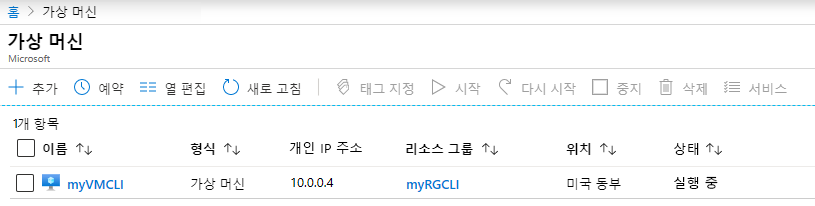
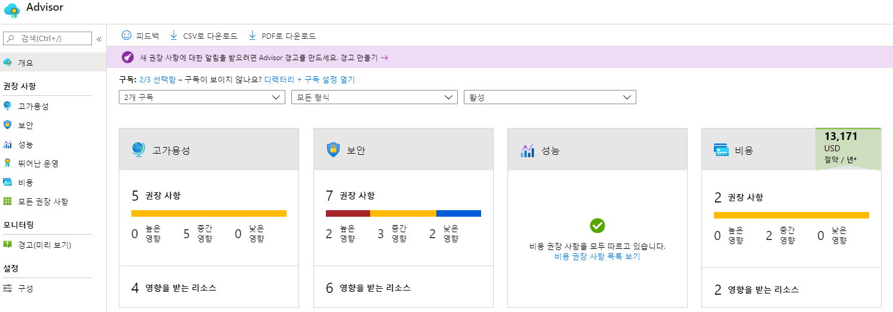
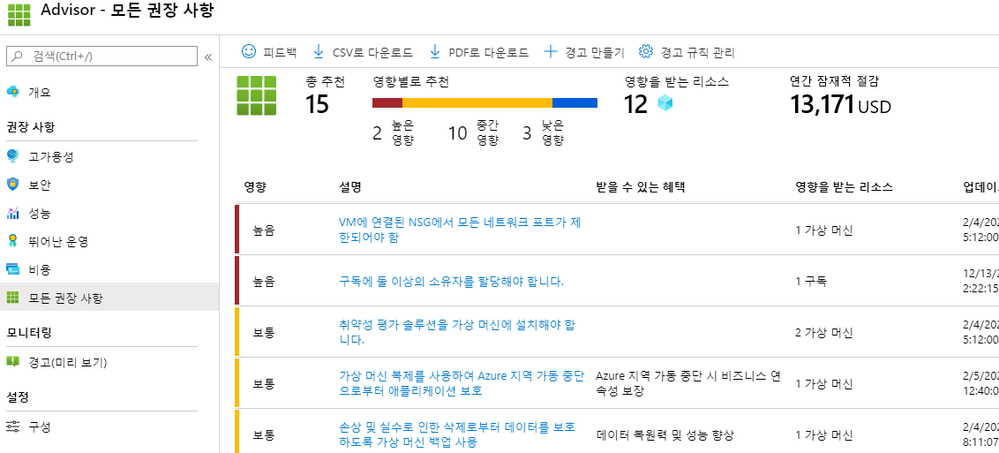

---
wts:
  title: 11 - CLI로 VM 만들기(10분)
  module: 'Module 03: Describe core solutions and management tools'
---
# <a name="11---create-a-vm-with-the-cli-10-min"></a>11 - CLI로 VM 만들기(10분)

이 연습에서는 Cloud Shell을 구성하고, Azure CLI 모듈을 사용하여 리소스 그룹 및 가상 머신을 만들고, Azure Advisor 권장 사항을 검토합니다. 

# <a name="task-1-configure-the-cloud-shell"></a>작업 1: Cloud Shell 구성 

이 작업에서는 Cloud Shell을 구성한 후에 Azure CLI를 사용하여 리소스 그룹과 가상 머신을 만듭니다.  

1. [Azure Portal](https://portal.azure.com)에 로그인합니다.

2. Azure Portal에서 오른쪽 상단의 아이콘을 클릭하여 **Azure Cloud Shell**을 엽니다.

    
   
3. Azure Cloud Shell 시작 대화 상자에서 **Bash** 또는 **PowerShell**을 선택하라는 메시지가 표시되면 **Bash**를 선택합니다. 

4. A new window will open stating <bpt id="p1">**</bpt>You have no storage mounted<ept id="p1">**</ept>. Select <bpt id="p1">**</bpt>advanced settings<ept id="p1">**</ept>.

5. 고급 설정 화면에서 다음 필드를 채운 후에 스토리지 만들기를 클릭합니다.
    - 리소스 그룹: **새 리소스 그룹 만들기**
    - 스토리지 계정: 전역적으로 고유한 이름을 사용하는 새 계정 만들기(예: loudshellxyzstorage)
    - 파일 공유: 새 파일 공유를 만들고 이름을 cloudshellfileshare로 지정


# <a name="task-2-use-cli-to-create-a-virtual-machine"></a>작업 2: CLI를 사용하여 가상 머신 만들기

이 작업에서는 Azure CLI를 사용하여 리소스 그룹과 가상 머신을 만듭니다.

1. Cloud Shell 창의 왼쪽 위 드롭다운 메뉴에서 **Bash**가 선택되어 있는지 확인합니다(그렇지 않다면 선택함).

    


2. 다음 명령을 입력하여 사용 중인 리소스 그룹을 확인합니다.

    ```cli
    az group list --output table
    ```

4. In Cloud Shell enter the command below and make sure that each line, except for the last one, is followed by the backslash (<ph id="ph1">`\`</ph>) character. If you type the whole command on the same line, do not use any backslash characters. 

    ```cli
    az vm create \
    --name myVMCLI \
    --resource-group myRGCLI \
    --image UbuntuLTS \
    --location EastUS2 \
    --admin-username azureuser \
    --admin-password Pa$$w0rd1234
    ```

    >**참고**: Windows 컴퓨터에서 명령줄을 사용하는 경우에는 백슬래시(`\`) 문자를 캐럿(`^`) 문자로 바꾸세요.

    <bpt id="p1">**</bpt>Note<ept id="p1">**</ept>: The command will take 2 to 3 minutes to complete. The command will create a virtual machine and various resources associated with it such as storage, networking and security resources. Do not continue to the next step until the virtual machine deployment is complete. 

5. 명령 실행이 완료되면 브라우저 창에서 Cloud Shell 창을 닫습니다.

6. Azure Portal에서 **가상 머신**을 검색하고 **myVMCLI**가 실행 중인지 확인합니다.

    


# <a name="task-3-execute-commands-in-the-cloud-shell"></a>작업 3: Cloud Shell에서 명령 실행

이 작업에서는 Cloud Shell에서 CLI 명령을 실행하는 연습을 합니다. 

1. Azure Portal에서 오른쪽 상단의 아이콘을 클릭하여 **Azure Cloud Shell**을 엽니다.

2. Cloud Shell 창의 왼쪽 위 드롭다운 메뉴에서 **Bash**가 선택되어 있는지 확인합니다.

3. Retrieve information about the virtual machine you provisioned, including name, resource group, location, and status. Notice the PowerState is <bpt id="p1">**</bpt>running<ept id="p1">**</ept>.

    ```cli
    az vm show --resource-group myRGCLI --name myVMCLI --show-details --output table 
    ```

4. Stop the virtual machine. Notice the message that billing continues until the virtual machine is deallocated. 

    ```cli
    az vm stop --resource-group myRGCLI --name myVMCLI
    ```

5. Verify your virtual machine status. The PowerState should now be <bpt id="p1">**</bpt>stopped<ept id="p1">**</ept>.

    ```cli
    az vm show --resource-group myRGCLI --name myVMCLI --show-details --output table 
    ```

# <a name="task-4-review-azure-advisor-recommendations"></a>작업 4: Azure Advisor 권장 사항 검토

이 작업에서는 Azure Advisor 권장 사항을 검토합니다.

   **참고:** 이전 랩(PowerShell로 VM 만들기)를 완료했다면 이미 이 작업을 수행한 것입니다. 

1. **모든 서비스** 블레이드에서 **Advisor**를 검색하고 선택합니다. 

2. On the <bpt id="p1">**</bpt>Advisor<ept id="p1">**</ept> blade, select <bpt id="p2">**</bpt>Overview<ept id="p2">**</ept>. Notice recommendations are grouped by Reliability, Security, Performance, and Cost. 

    

3. **모든 권장 사항**을 선택하고 각 권장 사항 및 제안되는 작업을 검토합니다. 

    **참고:** 권장 사항은 리소스에 따라 다를 수 있습니다. 

    

4. 권장 사항을 CSV 또는 PDF 파일로 다운로드할 수 있습니다. 

5. 경고를 만들 수도 있습니다. 

6. 시간이 있으면 Azure CLI를 사용하여 실험을 계속하세요. 

Congratulations! You have configured Cloud Shell, created a virtual machine using Azure CLI, practiced with Azure CLI commands, and viewed Advisor recommendations.

<bpt id="p1">**</bpt>Note<ept id="p1">**</ept>: To avoid additional costs, you can optionally remove this resource group. Search for resource groups, click your resource group, and then click <bpt id="p1">**</bpt>Delete resource group<ept id="p1">**</ept>. Verify the name of the resource group and then click <bpt id="p1">**</bpt>Delete<ept id="p1">**</ept>. Monitor the <bpt id="p1">**</bpt>Notifications<ept id="p1">**</ept> to see how the delete is proceeding.
