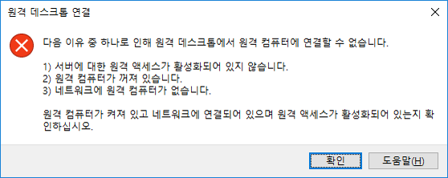

---
wts:
  title: 13 - 네트워크 트래픽 보안(10분)
  module: 'Module 04: Describe general security and network security features'
---
# 13 - 네트워크 트래픽 보안(10분)

이 연습에서는 네트워크 보안 그룹을 구성합니다.

# 작업 1: 가상 머신 만들기

이 작업에서는 Windows Server 2019 Datacenter 가상 머신을 만듭니다. 

1. [Azure Portal](https://portal.azure.com)에 로그인합니다.

2. **모든 서비스** 블레이드에서 **가상 머신**을 검색하여 선택한 다음 가상 머신 **+ 추가, + 만들기, + 새로 만들기**를 클릭합니다.

3. **기본** 탭에서 다음 정보를 채웁니다(다른 항목은 기본값을 사용).

    | 설정 | 값 |
    |  -- | -- |
    | 구독 | **제공된 기본값 사용** |
    | Resource group | **새 리소스 그룹 만들기** |
    | 가상 머신 이름 | **SimpleWinVM** |
    | 지역 | **(미국) 미국 동부**|
    | 이미지 | **Windows Server 2019 Datacenter Gen 2**|
    | 크기 | **표준 D2s v3**|
    | 관리자 계정 사용자 이름 | **azureuser** |
    | 관리자 계정 암호 | **Pa$$w0rd1234**|
    | 인바운드 포트 규칙 | **없음**|

4. **네트워킹** 탭으로 전환하고 다음 설정을 구성합니다.

    | 설정 | 값 |
    | -- | -- |
    | NIC 네트워크 보안 그룹 추가 | **없음**|

5. **관리** 탭으로 전환하고 **모니터링** 섹션에서 다음 설정을 선택합니다.

    | 설정 | 값 |
    | -- | -- |
    | 부트 진단 | 사용 안 함|

6. 나머지 기본값을 그대로 유지한 다음 페이지 하단에 있는 **검토 + 만들기** 단추를 클릭합니다.

7. Once Validation is passed click the <bpt id="p1">**</bpt>Create<ept id="p1">**</ept> button. It can take about five minutes to deploy the virtual machine.

8. Monitor the deployment. It may take a few minutes for the resource group and virtual machine to be created. 

9. 배포 블레이드 또는 알림 영역에서 **리소스로 이동**을 클릭합니다. 

10. **SimpleWinVM** 가상 머신 블레이드에서 **네트워킹**을 클릭하고, **인바운드 포트 규칙** 탭을 검토하고, 가상 머신의 네트워크 인터페이스나 네트워크 인터페이스가 연결된 서브넷과 연관된 네트워크 보안 그룹이 없는지 확인합니다.

    <bpt id="p1">**</bpt>Note<ept id="p1">**</ept>: Identify the name of the network interface. You will need it in the next task.

# 작업 2: 네트워크 보안 그룹 만들기

이 작업에서는 네트워크 보안 그룹을 만들고 네트워크 인터페이스와 연결합니다. 

1. **모든 서비스** 블레이드에서 **네트워크 보안 그룹**을 검색하여 선택한 다음 **+ 추가, + 만들기, + 새로 만들기**를 클릭합니다.

2. **네트워크 보안 그룹 만들기** 블레이드의 **기본** 탭에서 다음 설정을 지정합니다.

    | 설정 | 값 |
    | -- | -- |
    | 구독 | **제공된 구독 사용** |
    | Resource group | **드롭다운에서 기본값 선택** |
    | Name | **myNSGSecure** |
    | 지역 | **(미국) 미국 동부**  |

3. **검토 + 만들기**를 클릭하고 유효성 검사를 수행한 후 **만들기**를 클릭합니다.

4. NSG가 생성된 후 **리소스로 이동**을 클릭합니다.

5. **설정**에서 **네트워크 인터페이스**를 클릭한 다음 **연결**을 클릭합니다.

6. 이전 작업에서 확인한 네트워크 인터페이스를 선택합니다. 

# 작업 3: RDP를 허용하는 인바운드 보안 포트 규칙을 구성합니다.

이 작업에서는 인바운드 보안 포트 규칙을 구성하여 가상 머신에 대한 RDP 트래픽을 허용합니다. 

1. Azure Portal에서 **SimpleWinVM** 가상 머신의 블레이드로 이동합니다. 

2. **개요** 창에서 **연결**을 클릭합니다.

3. Attempt to connect to the virtual machine by selecting RDP and downloading an running the RDP file. By default the network security group does not allow RDP. Close the error window. 

    

4. 가상 머신 블레이드에서 **설정** 섹션으로 스크롤하고, **네트워킹**을 클릭하고, **myNSGSecure(네트워크 인터페이스에 연결됨: myVMNic)** 네트워크 보안 그룹의 인바운드 규칙이 가상 네트워크와 부하 분산 장치 프로브 내의 트래픽을 제외한 모든 인바운드 트래픽을 거부하는 것을 확인합니다.

5. On the <bpt id="p1">**</bpt>Inbound port rules<ept id="p1">**</ept> tab, click <bpt id="p2">**</bpt>Add inbound port rule<ept id="p2">**</ept> . Click <bpt id="p1">**</bpt>Add<ept id="p1">**</ept> when you are done. 

    | 설정 | 값 |
    | -- | -- |
    | 원본 | **임의**|
    | 원본 포트 범위 | **\*** |
    | 대상 | **임의** |
    | 대상 포트 범위 | **3389** |
    | 프로토콜 | **TCP** |
    | 작업 | **허용** |
    | 우선 순위 | **300** |
    | 이름 | **AllowRDP** |

6. Select <bpt id="p1">**</bpt>Add<ept id="p1">**</ept> and wait for the rule to be provisioned and then try again to RDP into the virtual machine by going back to <bpt id="p2">**</bpt>Connect<ept id="p2">**</ept> This time you should be successful. Remember the user is <bpt id="p1">**</bpt>azureuser<ept id="p1">**</ept> and the password is <bpt id="p2">**</bpt>Pa$$w0rd1234<ept id="p2">**</ept>.

# 작업 4: 인터넷 액세스를 거부하는 아웃바운드 보안 포트 규칙 구성

이 작업에서는 인터넷 액세스를 거부할 NSG 아웃바운드 포트 규칙을 만든 후에 테스트를 수행하여 규칙이 작동하는지 확인합니다.

1. 가상 머신 RDP 세션에서 계속합니다. 

2. 머신이 시작되면 **Internet Explorer** 브라우저를 엽니다. 

3. Verify that you can access <bpt id="p1">**</bpt><ph id="ph1">https://www.bing.com</ph><ept id="p1">**</ept> and then close Internet Explorer. You will need to work through the IE enhanced security pop-ups. 

    **참고**: 이제 아웃바운드 인터넷 액세스를 거부하는 규칙을 구성합니다. 

4. Azure Portal로 돌아가서 **SimpleWinVM** 가상 머신의 블레이드로 다시 이동합니다. 

5. **설정**에서 **네트워킹**을 클릭하고 **아웃바운드 포트 규칙**을 클릭합니다.

6. Notice there is a rule, <bpt id="p1">**</bpt>AllowInternetOutbound<ept id="p1">**</ept>. This a default rule and cannot be removed. 

7. Click <bpt id="p1">**</bpt>Add outbound port rule<ept id="p1">**</ept> to the right of the <bpt id="p2">**</bpt>myNSGSecure  (attached to network interface: myVMNic)<ept id="p2">**</ept> network security group and configure a new outbound security rule with a higher priority that will deny internet traffic. Click <bpt id="p1">**</bpt>Add<ept id="p1">**</ept> when you are finished. 

    | 설정 | 값 |
    | -- | -- |
    | 원본 | **임의**|
    | 원본 포트 범위 | **\*** |
    | 대상 | **서비스 태그** |
    | 대상 서비스 태그 | **인터넷** |
    | 대상 포트 범위 | **\*** |
    | 프로토콜 | **TCP** |
    | 작업 | **Deny** |
    | 우선 순위 | **4000** |
    | 이름 | **DenyInternet** |

8. **추가**를 클릭합니다. RDP한 VM으로 돌아갑니다. 

9. Browse to <bpt id="p1">**</bpt><ph id="ph1">https://www.microsoft.com</ph><ept id="p1">**</ept>. The page should not display. You may need to work through additional IE enhanced security pop-ups.  

<bpt id="p1">**</bpt>Note<ept id="p1">**</ept>: To avoid additional costs, you can optionally remove this resource group. Search for resource groups, click your resource group, and then click <bpt id="p1">**</bpt>Delete resource group<ept id="p1">**</ept>. Verify the name of the resource group and then click <bpt id="p1">**</bpt>Delete<ept id="p1">**</ept>. Monitor the <bpt id="p1">**</bpt>Notifications<ept id="p1">**</ept> to see how the delete is proceeding.
