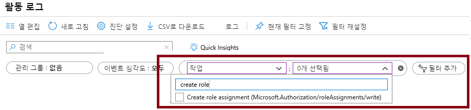

---
wts:
  title: 14 - RBAC로 액세스 관리(5분)
  module: 'Module 05: Describe identity, governance, privacy, and compliance features'
---
# 14 - RBAC로 액세스 관리(5분)

이 연습에서는 리소스에 권한 역할을 할당하고 로그를 봅니다.

# 작업 1: 역할 보기 및 할당

이 작업에서는 가상 머신 Contributor 역할을 할당합니다. 

1. [Azure Portal](https://portal.azure.com)에 로그인합니다.

2. **모든 서비스** 블레이드에서 **리소스 그룹**을 검색하여 선택한 다음 **+추가 +새로 만들기 +만들기**를 클릭합니다.

3. Create a new resource group. Click <bpt id="p1">**</bpt>Create<ept id="p1">**</ept> when you are finished. 

    | 설정 | 값 |
    | -- | -- |
    | 구독 | **제공된 기본값 사용** |
    | Resource group | **myRGRBAC** |
    | 지역 | **(미국) 미국 동부** |
   

4. **검토 + 만들기**를 클릭하고 **만들기**를 클릭합니다.

5. 리소스 그룹 페이지를 **새로 고치고** 새로 생성된 리소스 그룹을 나타내는 항목을 클릭합니다.

6. Click on the <bpt id="p1">**</bpt>Access control (IAM)<ept id="p1">**</ept> blade, and then switch to the <bpt id="p2">**</bpt>Roles<ept id="p2">**</ept> tab. Scroll through the large number of roles definitions that are available. Use the Informational icons to get an idea of each role's permissions. Notice there is also information on the number of users and groups that are assigned to each role.
7. 

7. Switch to the <bpt id="p1">**</bpt>Role assignments<ept id="p1">**</ept> tab of the <bpt id="p2">**</bpt>myRGRBAC - Access control (IAM)<ept id="p2">**</ept> blade, click <bpt id="p3">**</bpt>+ Add<ept id="p3">**</ept> and then click <bpt id="p4">**</bpt>Add role assignment<ept id="p4">**</ept>. Search for the Virtual Machine Contributor role and select. Switch to the "Members" tab and Assign access to: User, group, or service principal. Then click + Select members and type in your name to the popup search function and hit 'select.' Then hit 'Review and Assign'

    
    

 

    **참고:** 가상 머신 Contributor 역할을 통해 가상 머신을 관리할 수 있지만, 운영 체제에 액세스하거나 연결된 가상 네트워크 및 스토리지 계정을 관리할 수는 없습니다.

  

8. 역할 할당 페이지를 **새로 고치고** 이제 가상 머신 Contributor로 나열되었는지 확인합니다. 

    **참고**: 이 할당은 실제로 추가적인 권한을 부여하지는 않습니다. Contributor 역할과 연관된 모든 권한을 포함하는 Owner 역할이 이미 계정에 있기 때문입니다.

# 작업 2: 역할 할당 모니터링 및 역할 제거

이 작업에서는 활동 로그를 보고 역할 할당을 확인한 후 역할을 제거합니다. 

1. myRGRBAC 리소스 그룹 블레이드에서 **활동 로그**를 클릭합니다.

2. **필터 추가**를 클릭하고 **작업**을 선택한 다음 **역할 할당 만들기**를 선택합니다.

    

3. 활동 로그에 역할 할당이 표시되는지 확인합니다. 

    **참고**: 역할 할당을 제거하는 방법을 알고 있습니까?

Congratulations! You created a resource group, assigned an access role to it and viewed activity logs. 

<bpt id="p1">**</bpt>Note<ept id="p1">**</ept>: To avoid additional costs, you can optionally remove this resource group. Search for resource groups, click your resource group, and then click <bpt id="p1">**</bpt>Delete resource group<ept id="p1">**</ept>. Verify the name of the resource group and then click <bpt id="p1">**</bpt>Delete<ept id="p1">**</ept>. Monitor the <bpt id="p1">**</bpt>Notifications<ept id="p1">**</ept> to see how the delete is proceeding.

