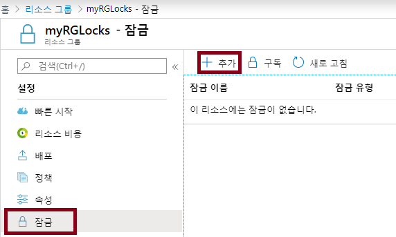
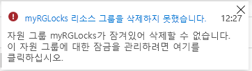
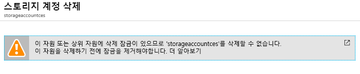
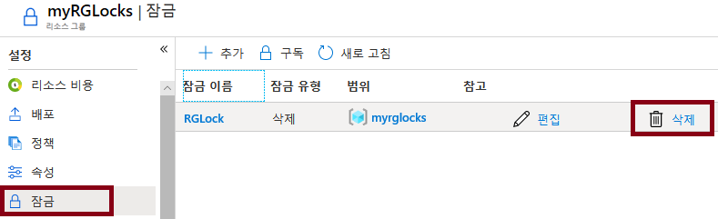

---
wts:
  title: 15 - 리소스 잠금 관리(5분)
  module: 'Module 05: Describe identity, governance, privacy, and compliance features'
---
# 15 - 리소스 잠금 관리(5분)

In this walkthrough, we will add a lock to the resource group and test deleting the resource group. Locks can be applied in a subscription to resource groups, or individual resources to prevent accidental deletion or modification of critical resources.  

# 작업 1:  리소스 그룹에 잠금 추가 및 삭제 테스트

이 작업에서는 리소스 그룹에 리소스 잠금을 추가하고 리소스 그룹 삭제를 테스트합니다. 

1. [Azure Portal](https://portal.azure.com)에 로그인합니다.

2. Azure Portal에서 리소스 그룹 **myRGLocks**로 이동합니다.

3. 구독, 리소스 그룹 또는 개별 리소스에 잠금을 적용하면 중요한 리소스가 실수로 삭제되거나 수정되는 상황을 방지할 수 있습니다. 

4. **설정** 섹션에서 **잠금**을 클릭한 다음 **+ 추가**를 클릭합니다. 

    

5. Configure the new lock. When you are done click <bpt id="p1">**</bpt>OK<ept id="p1">**</ept>. 

    | 설정 | 값 |
    | -- | -- |
    | 잠금 이름 | '''RGLock''' |
    | 잠금 유형 | **삭제** |
    | | |

6. Click <bpt id="p1">**</bpt>Overview<ept id="p1">**</ept> and click <bpt id="p2">**</bpt>Delete resource group<ept id="p2">**</ept>. Type the name of the resource group and click <bpt id="p1">**</bpt>OK<ept id="p1">**</ept>. You receive an error message stating the resource group is locked and can't be deleted.

    

# 작업 2: 리소스 그룹의 구성원 삭제 테스트

이 작업에서는 리소스 잠금이 리소스 그룹의 스토리지 계정을 보호하는지 테스트합니다. 

1. **모든 서비스** 블레이드에서 **스토리지 계정**을 검색하여 선택한 다음 **+ 추가, + 만들기 또는 + 새로 만들기**를 클릭합니다. 

2. 이 연습에서는 리소스 그룹에 잠금을 추가하고 리소스 그룹 삭제를 테스트합니다.

    | 설정 | 값 | 
    | --- | --- |
    | 구독 | **구독 선택** |
    | Resource group | **myRGLocks** |
    | 스토리지 계정 이름 | **storageaccountxxxx** |
    | 위치 | **(미국) 미국 동부**  |
    | 성능 | **Standard** |
    | 계정 종류 | **StorageV2(범용 v2)** |
    | 복제 | **LRS(로컬 중복 스토리지)** |
    | 액세스 계층(기본값) | **핫** |
   

3. **검토 + 만들기**를 클릭하여 스토리지 계정 설정을 검토하고 Azure에서 구성의 유효성을 검사할 수 있도록 허용합니다. 

4. 구독에서 리소스 그룹 또는 개별 리소스에 잠금을 적용하여 중요한 리소스가 실수로 삭제되거나 수정되는 상황을 방지할 수 있습니다. 

5.  스토리지 계정이 성공적으로 생성되었다는 알림을 기다립니다. 

6. Access your new storage account and from the <bpt id="p1">**</bpt>Overview<ept id="p1">**</ept> pane, click <bpt id="p2">**</bpt>Delete<ept id="p2">**</ept>. You receive an error message stating the resource or its parent has a delete lock. 

    

    <bpt id="p1">**</bpt>Note<ept id="p1">**</ept>: Although we did not create a lock specifically for the storage account, we did create a lock at the resource group level, which contains the storage account. As such, this <bpt id="p1">*</bpt>parent<ept id="p1">*</ept> level lock prevents us from deleting the resource and the storage account inherits the lock from the parent.

# 작업 3: 리소스 잠금 제거

이 작업에서는 리소스 잠금을 제거하고 테스트합니다. 

1. **myRGLocks-XXXXXXXX** 리소스 그룹 블레이드로 돌아가 **설정** 섹션에서 **잠금**을 클릭합니다.
    
2. **myRGLocks-XXXXXXXX** 항목의 맨 오른쪽에서, **편집** 바로 오른쪽에 있는 **삭제** 링크를 클릭합니다.

    

3. 스토리지 계정 블레이드로 돌아가서 리소스를 삭제할 수 있는지 확인합니다.

Congratulations! You created a resource group, added a lock to resource group and tested deletion, tested deleting a resource in the resource group, and removed the resource lock. 

<bpt id="p1">**</bpt>Note<ept id="p1">**</ept>: To avoid additional costs, you can optionally remove this resource group. Search for resource groups, click your resource group, and then click <bpt id="p1">**</bpt>Delete resource group<ept id="p1">**</ept>. Verify the name of the resource group and then click <bpt id="p1">**</bpt>Delete<ept id="p1">**</ept>. Monitor the <bpt id="p1">**</bpt>Notifications<ept id="p1">**</ept> to see how the delete is proceeding.
