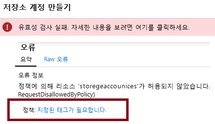
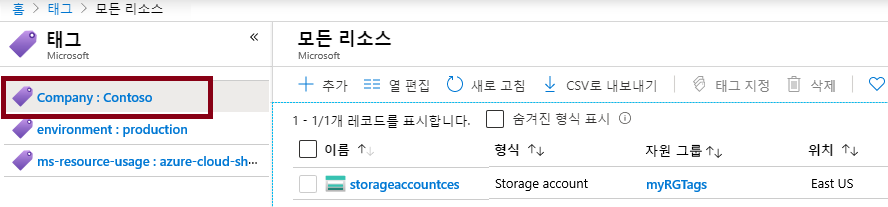
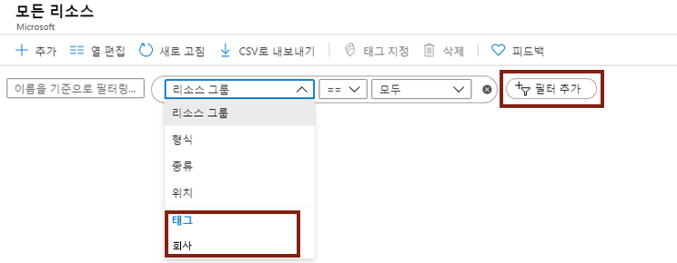

---
wts:
  title: 16 - 리소스 태그 지정 구현(5분)
  module: 'Module 05: Describe identity, governance, privacy, and compliance features'
---
# 16 - 리소스 태그 지정 구현(5분)

이 연습에서는 태그 지정을 요구하는 정책 할당을 만들고, 스토리지 계정을 만들고, 태그를 테스트하고, 지정된 태그가 있는 리소스를 보고, 태그 지정 정책을 제거합니다.

# 작업 1: 정책 할당 만들기 

이 작업에서는 **리소스에 태그 필요** 정책을 구성하고 구독에 할당합니다. 

1. [Azure Portal](https://portal.azure.com)에 로그인합니다.

2. **모든 서비스** 블레이드에서 **정책**을 검색하고 선택합니다.

3. **작성** 섹션으로 스크롤하고, **할당**을 클릭하고, 페이지 위쪽에서 **정책 할당**을 클릭합니다.

4. 정책의 **범위**는 구독 전체입니다. 

5. Under <bpt id="p1">**</bpt>Basics<ept id="p1">**</ept> Select the <bpt id="p2">**</bpt>Policy definition<ept id="p2">**</ept> ellipsis button (right side of textbox). In the <bpt id="p1">**</bpt>Search<ept id="p1">**</ept> box, enter the value <bpt id="p2">**</bpt>tag<ept id="p2">**</ept>. A list of related Policies with the word <bpt id="p1">**</bpt>tag<ept id="p1">**</ept> will appear. Scroll down till you find the <bpt id="p1">**</bpt>Require a tag and its value on resources<ept id="p1">**</ept> definition, click on it and click <bpt id="p2">**</bpt>Select<ept id="p2">**</ept>.

   
   
6.  On the <bpt id="p1">**</bpt>Parameters<ept id="p1">**</ept> tab, type in **Company : Contoso ** for the tag key/value pair name. Click <bpt id="p1">**</bpt>Review + create<ept id="p1">**</ept>, and then <bpt id="p2">**</bpt>Create<ept id="p2">**</ept>.

  

7. The <bpt id="p1">**</bpt>Require a tag amd its value on resources<ept id="p1">**</ept> policy assignment is now in place. When a resource is created, it must include a tag with the Company : Contoso key.
   <bpt id="p1">**</bpt>Note - you need to wait up to 30 minutes for the Policy to be applied.<ept id="p1">**</ept> 

  

# 작업 2: 스토리지 계정을 만들어 필요한 태그 지정 테스트

이 작업에서는 스토리지 계정을 만들어 필요한 태그 지정을 테스트합니다. 

1. Azure Portal의 **모든 서비스** 블레이드에서 **스토리지 계정**을 검색하여 선택한 다음 **+추가 +새로 만들기 +만들기**를 클릭합니다.

2. On the <bpt id="p1">**</bpt>Basics<ept id="p1">**</ept> tab of the <bpt id="p2">**</bpt>Create storage account<ept id="p2">**</ept> blade, fill in the following information (replace <bpt id="p3">**</bpt>xxxx<ept id="p3">**</ept> in the name of the storage account with letters and digits such that the name is globally unique). Leave the defaults for everything else.

    | 설정 | 값 | 
    | --- | --- |
    | 구독 | **제공된 기본값 사용** |
    | Resource group | **새 리소스 그룹 만들기** |
    | 스토리지 계정 이름 | **storageaccountxxxx** |
    | 위치 | **(미국) 미국 동부** |

3. **검토 + 만들기**를 클릭합니다. 

    <bpt id="p1">**</bpt>Note:<ept id="p1">**</ept> We are testing to see what happens when the tag is not supplied. Please note, it can take up to 30 minutes for Policies to take effect.

4. You will receive a Validation failed message. Click the <bpt id="p1">**</bpt>Click here to view details<ept id="p1">**</ept> message. On the <bpt id="p1">**</bpt>Errors<ept id="p1">**</ept> blade, on the <bpt id="p2">**</bpt>Summary<ept id="p2">**</ept> tab note the error message stating that resource was disallowed by Policy.

    **참고:** Raw 오류 탭에는 필요한 특정 태그 이름이 표시됩니다. 

    

5. Close the <bpt id="p1">**</bpt>Error<ept id="p1">**</ept> pane and click <bpt id="p2">**</bpt>Previous<ept id="p2">**</ept> (bottom of the screen). Provide the tagging information. 

    | 설정 | 값 | 
    | --- | --- |
    | 태그 이름 | **Company:Contoso**(드롭다운 목록에 없을 수 있음) |

6. Click <bpt id="p1">**</bpt>Review + create<ept id="p1">**</ept> and verify that the validation was successful. Click <bpt id="p1">**</bpt>Create<ept id="p1">**</ept> to deploy the storage account. 

# 작업 3: 특정 태그가 있는 모든 리소스 보기

1. Azure Portal의 **모든 서비스** 블레이드에서 **태그**를 검색하고 선택합니다.

2. Note all tags and their values. Click the <bpt id="p1">**</bpt>Company : Contoso<ept id="p1">**</ept> key/value pair. This will display a blade showing the newly created storage account, as long as you included the tag during its deployment. 

   

3. Portal에서 **모든 리소스** 블레이드를 표시합니다.

4. Click <bpt id="p1">**</bpt>Add filter<ept id="p1">**</ept> and add the <bpt id="p2">**</bpt>Company<ept id="p2">**</ept> tag key as the filter category. With the filter applied, only your storage account will be listed.

    

# 작업 4: 정책 할당 삭제

이 작업에서는 미래의 작업에 영향을 미치지 않도록 **리소스에 태그 필요** 정책을 제거합니다. 

1. 포털의 **모든 서비스** 블레이드에서 **정책**을 검색하고 선택합니다.

2. **리소스에 태그 필요** 정책 항목을 클릭합니다.

3. 최상위 메뉴에서 **할당 삭제**를 클릭합니다.

4. **할당 삭제** 대화 상자에서 **예**를 클릭하여 정책 삭제를 확인합니다.

5. 시간이 있으면 태그가 없는 다른 리소스를 만들어서 정책이 더 이상 적용되지 않는지를 확인합니다.

**기초**에서 **정책 정의** 줄임표 단추(텍스트 상자 오른쪽)를 선택합니다.

**검색** 상자에 **tag**라는 값을 입력합니다.
