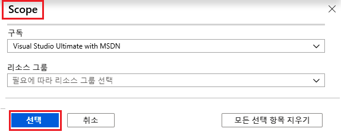
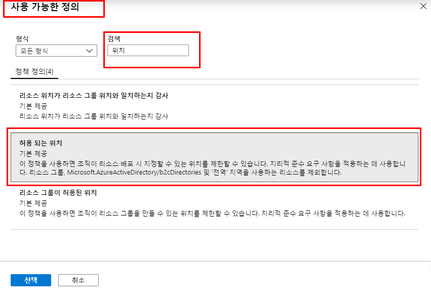
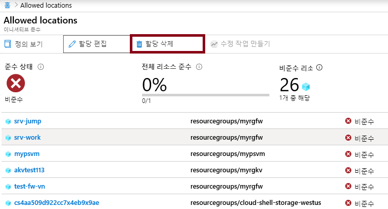

---
wts:
  title: 17 - Azure Policy 만들기(10분)
  module: 'Module 05: Describe identity, governance, privacy, and compliance features'
---
# 17 - Azure Policy 만들기(10분)

이 연습에서는 Azure 리소스의 배포를 특정 위치로 제한하는 Azure Policy를 만듭니다.

# 작업 1: 정책 할당 만들기 

이 작업에서는 허용된 위치 정책을 구성하고 구독에 할당합니다. 

1. [Azure Portal](https://portal.azure.com)에 로그인합니다.

2. From the <bpt id="p1">**</bpt>All services<ept id="p1">**</ept> blade, search for and select <bpt id="p2">**</bpt>Policy<ept id="p2">**</ept>, under the <bpt id="p3">**</bpt>Authoring<ept id="p3">**</ept> section click <bpt id="p4">**</bpt>Definitions<ept id="p4">**</ept>.  Take a moment to review the list of built-in policy definitions. For example, in the <bpt id="p1">**</bpt>Category<ept id="p1">**</ept> drop-down select only <bpt id="p2">**</bpt>Compute<ept id="p2">**</ept>. Notice the <bpt id="p1">**</bpt>Allowed virtual machine size SKUs<ept id="p1">**</ept> definition enables you to specify a set of virtual machine SKUs that your organization can deploy.

3. Return to the <bpt id="p1">**</bpt>Policy<ept id="p1">**</ept> page, under the <bpt id="p2">**</bpt>Authoring<ept id="p2">**</ept> section click <bpt id="p3">**</bpt>Assignments<ept id="p3">**</ept>. An assignment is a policy that has been assigned to take place within a specific scope. For example, a definition could be assigned to the subscription scope. 

4. **정책 - 할당** 페이지의 위쪽에서 **정책 할당**을 클릭합니다.

5. **정책 할당** 풀 페이지에서 기본 범위를 유지합니다.

      | 설정 | 값 | 
    | --- | --- |
    | Scope| **선택된 기본값 사용**|
    | 정책 정의 | 줄임표를 클릭한 후에 **허용된 위치**를 검색하고 **선택** |
    | 할당 이름 | **허용되는 위치** |
    
    
6. On the <bpt id="p1">**</bpt>Parameters<ept id="p1">**</ept> tab, select <bpt id="p2">**</bpt>Japan West<ept id="p2">**</ept>. Click <bpt id="p1">**</bpt>Review + create<ept id="p1">**</ept>, and then <bpt id="p2">**</bpt>Create<ept id="p2">**</ept>.

    <bpt id="p1">**</bpt>Note<ept id="p1">**</ept>: A scope determines what resources or grouping of resources the policy assignment applies to. In our case we could assign this policy to a specific resource group, however we chose to assign the policy at subscription level. Be aware that resources can be excluded based on the scope configuration. Exclusions are optional.

    <bpt id="p1">**</bpt>Note<ept id="p1">**</ept>: This <bpt id="p2">**</bpt>Allowed Locations<ept id="p2">**</ept> policy definition will specify a location into which all resources must be deployed. If a different location is chosen, deployment will not be allowed. For more information view the <bpt id="p1">[</bpt>Azure Policy Samples<ept id="p1">](https://docs.microsoft.com/en-us/azure/governance/policy/samples/index)</ept> page.

   

9. 이제 **허용된 위치** 정책 할당이 **정책 - 할당** 창에 표시되며, 지정한 범위 수준(구독 수준)에서 정책을 적용합니다.

# 작업 2: 허용된 위치 정책 테스트

이 작업에서는 허용된 위치 정책을 테스트합니다. 

1. Azure Portal의 **모든 서비스** 블레이드에서 **스토리지 계정**을 검색하여 선택한 다음 **+ 만들기**를 클릭합니다.

2. Configure the storage account (replace <bpt id="p1">**</bpt>xxxx<ept id="p1">**</ept> in the name of the storage account with letters and digits such that the name is globally unique). Leave the defaults for everything else. 

    | 설정 | 값 | 
    | --- | --- |
    | 구독 | **제공된 기본값 사용** |
    | Resource group | **myRGPolicy**(새로 만들기) |
    | 스토리지 계정 이름 | **storageaccountxxxx** |
    | 위치 | **(미국) 미국 동부** |

3. **검토 + 만들기**를 클릭한 다음, **만들기**를 클릭합니다. 

4. 정책에 의해 리소스가 거부되었다는 내용의 **배포 실패** 오류를 받게 되며, **허용된 위치** 정책 이름이 이 메시지에 포함됩니다.

# 작업 3: 정책 할당 삭제

이 작업에서는 허용된 위치 정책 할당을 제거하고 테스트합니다. 

향후 수행하려는 작업이 차단되지 않도록 정책 할당을 삭제합니다.

1. **모든 서비스** 블레이드에서 **정책**을 검색하여 선택한 다음 **허용된 위치** 정책을 클릭합니다.

    **참고**: **정책** 블레이드에서 할당한 다양한 정책의 규정 준수 상태를 볼 수 있습니다.

    <bpt id="p1">**</bpt>Note<ept id="p1">**</ept>: The Allowed location policy may show non-compliant resources. If so, these are resources created prior to the policy assignment.
 
2. **허용된 위치**를 클릭합니다. 허용된 위치 정책 규정 준수 창이 열립니다.

3. **모든 서비스** 블레이드에서 **정책**을 검색하여 선택하고 **작성** 섹션 아래에서 **정의**를 클릭합니다.

   

4. 다른 스토리지 계정을 만들어 정책이 더 이상 적용되지 않는지 확인합니다.

    **참고**: **허용된 위치** 정책이 유용할 수 있는 일반적인 시나리오는 다음과 같습니다. 
    - 잠시 시간을 내서 기본 제공 정책 정의 목록을 검토합니다. 
    - *데이터 보존 및 보안 규정 준수*: 또한 데이터 보존 요구 사항이 있는 경우 고객 또는 특정 워크로드별로 구독을 만들고 모든 리소스를 특정 데이터 센터에 배포하도록 정의하면 데이터 및 보안 규정 준수 요구 사항을 준수할 수 있습니다.

예를 들어 **범주** 드롭다운에서 **컴퓨팅**만 선택합니다.

**허용된 가상 머신 SKU 크기** 정의를 사용하면 조직에서 배포할 수 있는 가상 머신의 SKU 집합을 지정할 수 있습니다.
