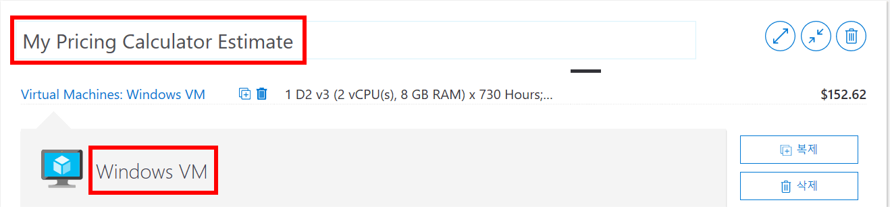
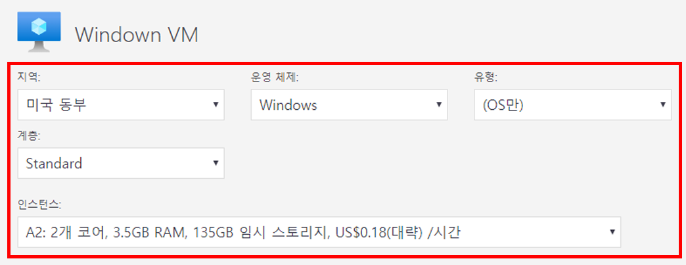
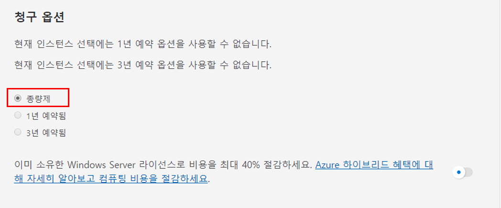
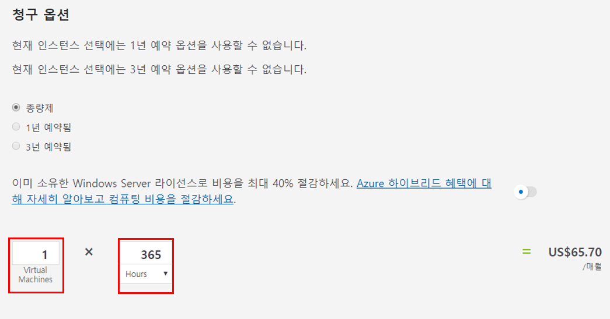
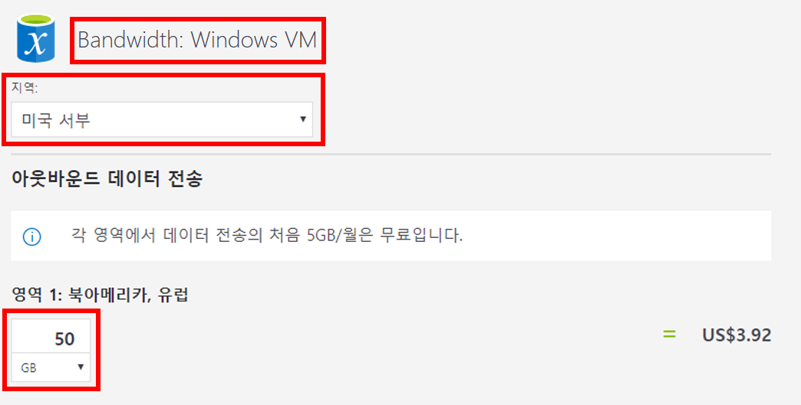
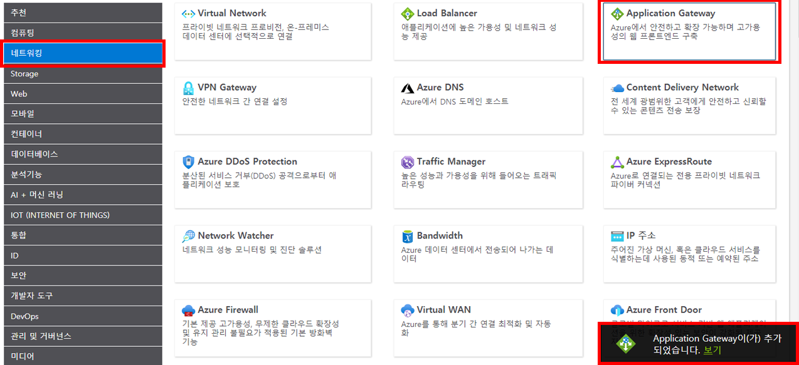
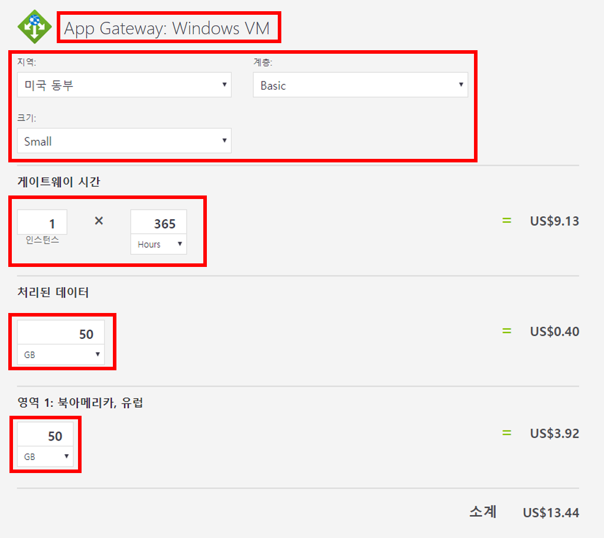
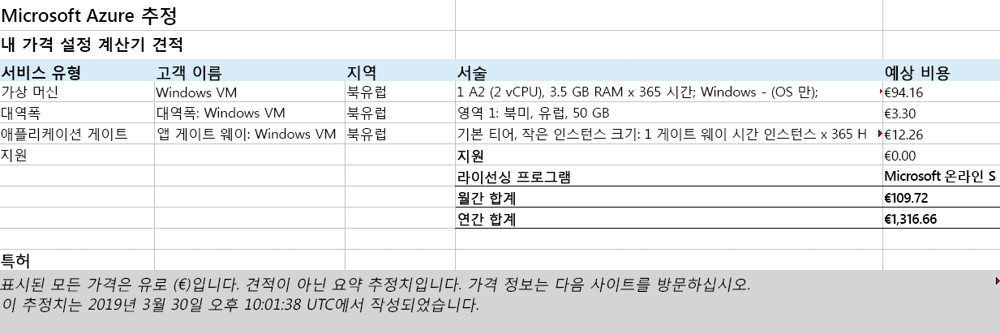

---
wts:
  title: 19 - Azure 가격 책정 계산기 사용(10분)
  module: 'Module 06: Describe Azure cost management and service level agreements'
---
# 19 - 가격 책정 계산기 사용(10분)

이 연습에서는 Azure 가격 계산기를 사용하여 Azure 가상 머신 및 관련 네트워크 리소스에 대한 예상 비용을 생성합니다.

# 작업 1: 가격 계산기 구성

이 작업에서는 Azure 가격 계산기를 사용하여 샘플 인프라의 비용을 추산합니다. 

<bpt id="p1">**</bpt>Note<ept id="p1">**</ept>: To create an Azure Pricing Calculator estimate, this walkthrough provides example configurations for the VM and related resources. Use this example configurations or provide the Azure Pricing Calculator with details of your <bpt id="p1">*</bpt>actual<ept id="p1">*</ept> resource requirements instead.

1. 브라우저에서 [Azure 가격 계산기](https://azure.microsoft.com/en-us/pricing/calculator/) 웹 페이지로 이동합니다.

2. VM 구성의 세부 정보를 추가하려면 **제품** 탭에서 **가상 머신**을 클릭합니다. 아래로 스크롤하여 가상 머신 세부 정보를 봅니다. 

3. Replace <bpt id="p1">**</bpt>Your Estimate<ept id="p1">**</ept> and <bpt id="p2">**</bpt>Virtual Machines<ept id="p2">**</ept> text with more descriptive names for your Azure Pricing Calculator estimate and your VM configuration. This walkthrough example uses <bpt id="p1">**</bpt>My Pricing Calculator Estimate<ept id="p1">**</ept> for the estimate, and <bpt id="p2">**</bpt>Windows VM<ept id="p2">**</ept> for the VM configuration.

   

4. 기본 VM 구성을 수정합니다.

    | 설정 | 값 |
    | -- | -- |
    | 지역 | **북유럽** |
    | 운영 체제 | **Windows** |
    | 형식 | **(OS만)** |
    | 서비스 계층 | **Standard** |  
    | 인스턴스 | **A2: 2코어, 3.5GB RAM, 135GB 임시 스토리지** |

   

    <bpt id="p1">**</bpt>Note<ept id="p1">**</ept>: The VM instance specifications and pricing may differ from those in this example. Follow this walkthrough by choosing an instance that matches the example as closely as possible. To view details about the different VM product options, choose <bpt id="p1">**</bpt>Product details<ept id="p1">**</ept> from the <bpt id="p2">**</bpt>More info<ept id="p2">**</ept> menu on the right.

5. **청구 옵션**을 **종량제**로 설정합니다.

   

6. **참고**: Azure 가격 계산기 예상액을 만들기 위해 이 연습에서는 VM 및 관련 리소스에 대한 예제 구성을 제공합니다.

    VM 수를 `1`로 설정하고 월별 시간 값을 `365`로 변경합니다.

   

7. **관리 OS 디스크** 창에서 기본 VM스토리지 구성을 수정합니다.

    | 계층 | 디스크 크기 | 디스크 수 | 스냅샷 | 스토리지 트랜잭션 |
    | ---- | --------- | --------------- | -------- | -------------------- |
    | 표준 HDD | S30: 1024GiB | 1 | 끄기 | 10000 |

   

8. To add networking bandwidth to your estimate, go to the top of the Azure Pricing Calculator webpage. Click <bpt id="p1">**</bpt>Networking<ept id="p1">**</ept> in the product menu on the left, then click the <bpt id="p2">**</bpt>Bandwidth<ept id="p2">**</ept> tile. In the <bpt id="p1">**</bpt>Bandwidth added<ept id="p1">**</ept> message dialog, click <bpt id="p2">**</bpt>View<ept id="p2">**</ept>.

   

9. **예상값** 및 **가상 머신** 텍스트를 Azure 가격 계산기 예상값과 VM 구성에 대해 좀더 자세히 설명하는 이름으로 바꿉니다.

    | 지역 | 영역 1 아웃바운드 데이터 전송 양 |
    | ------ | -------------------------------------- |
    | 북유럽 | 50GB |

   

10. To add an Application Gateway, return to the top of the Azure Pricing Calculator webpage. In the <bpt id="p1">**</bpt>Networking<ept id="p1">**</ept> product menu, click the <bpt id="p2">**</bpt>Application Gateway<ept id="p2">**</ept> tile. In the <bpt id="p1">**</bpt>Application Gateway<ept id="p1">**</ept> message dialog, click <bpt id="p2">**</bpt>View<ept id="p2">**</ept>.

    

11. 강조 표시된 예상액 이름과 VM 구성 이름은 예상액 이름과 VM 구성 이름을 Azure 가격 계산기 예상액에 추가하는 방법을 나타냅니다.

    | 설정 | 값 |
    | -- | -- |
    | 지역 | **북유럽** |
    | 계층 | **기본** |
    | 크기 | **소형** |
    | 인스턴스 | **1** |  
    | 시간 | **365** |
    | 처리된 데이터 | **50GB** |
    | 영역 1: 북미, 유럽 | **50GB**|

    

# 작업 2: 예상 가격 검토

이 작업에서는 Azure 가격 계산기의 결과를 검토합니다. 

1. Azure 가격 계산기 웹 페이지의 아래쪽으로 스크롤하고 총 **예상 월별 비용**을 봅니다.

    <bpt id="p1">**</bpt>Note<ept id="p1">**</ept>: Explore the various options available within the Azure Pricing Calculator. For example, this walkthrough requires you to update the currency to Euro.

2. 통화를 유로로 변경한 다음 **내보내기**를 선택하여 Microsoft Excel(`.xlsx`) 형식으로 오프라인으로 볼 수 있는 예상액의 복사본을 다운로드합니다.

    

    

Congratulations! You downloaded an estimate from the Azure Pricing Calculator.
